# Mermaid Module Diagrams

All 39 DBML modules rendered as Mermaid ER diagrams in one markdown file.

## 01-authentication.dbml

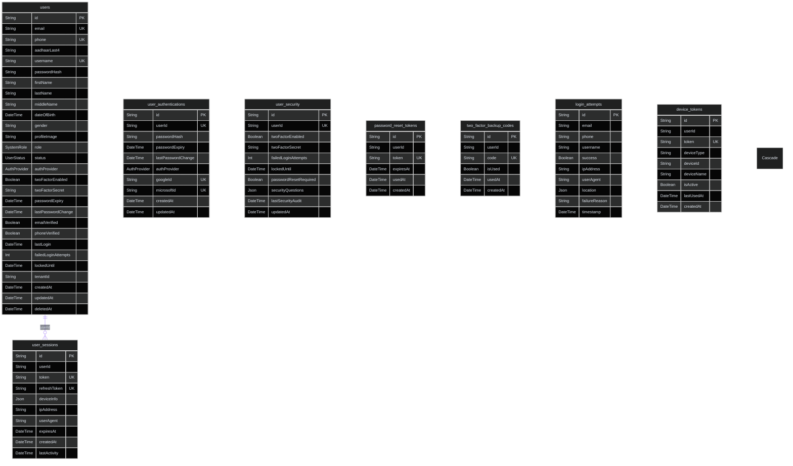
```mermaid
%%{init: {"theme":"dark","themeVariables":{"fontFamily":"Inter, Segoe UI, Arial, sans-serif","background":"#0f172a","primaryColor":"#1e293b","secondaryColor":"#111827","tertiaryColor":"#0b1020","primaryBorderColor":"#8b5cf6","secondaryBorderColor":"#38bdf8","tertiaryBorderColor":"#14b8a6","lineColor":"#8b5cf6","textColor":"#e2e8f0","fontSize":"16px"}}}%%
erDiagram
  %% Source: dbml-modules/01-authentication.dbml
  %% Tables: 8
  %% Internal relationships: 1
  %% Table: users
  users {
    String id PK
    String email UK
    String phone UK
    String aadhaarLast4
    String username UK
    String passwordHash
    String firstName
    String lastName
    String middleName
    DateTime dateOfBirth
    String gender
    String profileImage
    SystemRole role
    UserStatus status
    AuthProvider authProvider
    Boolean twoFactorEnabled
    String twoFactorSecret
    DateTime passwordExpiry
    DateTime lastPasswordChange
    Boolean emailVerified
    Boolean phoneVerified
    DateTime lastLogin
    Int failedLoginAttempts
    DateTime lockedUntil
    String tenantId
    DateTime createdAt
    DateTime updatedAt
    DateTime deletedAt
  }
  %% Table: user_sessions
  user_sessions {
    String id PK
    String userId
    String token UK
    String refreshToken UK
    Json deviceInfo
    String ipAddress
    String userAgent
    DateTime expiresAt
    DateTime createdAt
    DateTime lastActivity
  }
  %% Table: user_authentications
  user_authentications {
    String id PK
    String userId UK
    String passwordHash
    DateTime passwordExpiry
    DateTime lastPasswordChange
    AuthProvider authProvider
    String googleId UK
    String microsoftId UK
    DateTime createdAt
    DateTime updatedAt
  }
  %% Table: user_security
  user_security {
    String id PK
    String userId UK
    Boolean twoFactorEnabled
    String twoFactorSecret
    Int failedLoginAttempts
    DateTime lockedUntil
    Boolean passwordResetRequired
    Json securityQuestions
    DateTime lastSecurityAudit
    DateTime updatedAt
  }
  %% Table: password_reset_tokens
  password_reset_tokens {
    String id PK
    String userId
    String token UK
    DateTime expiresAt
    DateTime usedAt
    DateTime createdAt
  }
  %% Table: two_factor_backup_codes
  two_factor_backup_codes {
    String id PK
    String userId
    String code UK
    Boolean isUsed
    DateTime usedAt
    DateTime createdAt
  }
  %% Table: login_attempts
  login_attempts {
    String id PK
    String email
    String phone
    String username
    Boolean success
    String ipAddress
    String userAgent
    Json location
    String failureReason
    DateTime timestamp
  }
  %% Table: device_tokens
  device_tokens {
    String id PK
    String userId
    String token UK
    String deviceType
    String deviceId
    String deviceName
    Boolean isActive
    DateTime lastUsedAt
    DateTime createdAt
  }

  %% Relationships
  users ||--o{ user_sessions : userId Cascade

```

## 02-rbac-permissions.dbml

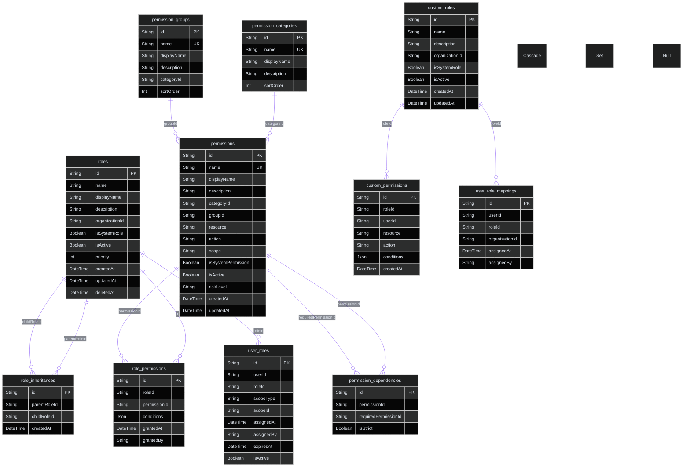
```mermaid
%%{init: {"theme":"dark","themeVariables":{"fontFamily":"Inter, Segoe UI, Arial, sans-serif","background":"#0f172a","primaryColor":"#1e293b","secondaryColor":"#111827","tertiaryColor":"#0b1020","primaryBorderColor":"#8b5cf6","secondaryBorderColor":"#38bdf8","tertiaryBorderColor":"#14b8a6","lineColor":"#8b5cf6","textColor":"#e2e8f0","fontSize":"16px"}}}%%
erDiagram
  %% Source: dbml-modules/02-rbac-permissions.dbml
  %% Tables: 11
  %% Internal relationships: 11
  %% Table: roles
  roles {
    String id PK
    String name
    String displayName
    String description
    String organizationId
    Boolean isSystemRole
    Boolean isActive
    Int priority
    DateTime createdAt
    DateTime updatedAt
    DateTime deletedAt
  }
  %% Table: permissions
  permissions {
    String id PK
    String name UK
    String displayName
    String description
    String categoryId
    String groupId
    String resource
    String action
    String scope
    Boolean isSystemPermission
    Boolean isActive
    String riskLevel
    DateTime createdAt
    DateTime updatedAt
  }
  %% Table: role_permissions
  role_permissions {
    String id PK
    String roleId
    String permissionId
    Json conditions
    DateTime grantedAt
    String grantedBy
  }
  %% Table: permission_categories
  permission_categories {
    String id PK
    String name UK
    String displayName
    String description
    Int sortOrder
  }
  %% Table: permission_groups
  permission_groups {
    String id PK
    String name UK
    String displayName
    String description
    String categoryId
    Int sortOrder
  }
  %% Table: permission_dependencies
  permission_dependencies {
    String id PK
    String permissionId
    String requiredPermissionId
    Boolean isStrict
  }
  %% Table: role_inheritances
  role_inheritances {
    String id PK
    String parentRoleId
    String childRoleId
    DateTime createdAt
  }
  %% Table: user_roles
  user_roles {
    String id PK
    String userId
    String roleId
    String scopeType
    String scopeId
    DateTime assignedAt
    String assignedBy
    DateTime expiresAt
    Boolean isActive
  }
  %% Table: custom_roles
  custom_roles {
    String id PK
    String name
    String description
    String organizationId
    Boolean isSystemRole
    Boolean isActive
    DateTime createdAt
    DateTime updatedAt
  }
  %% Table: custom_permissions
  custom_permissions {
    String id PK
    String roleId
    String userId
    String resource
    String action
    Json conditions
    DateTime createdAt
  }
  %% Table: user_role_mappings
  user_role_mappings {
    String id PK
    String userId
    String roleId
    String organizationId
    DateTime assignedAt
    String assignedBy
  }

  %% Relationships
  custom_roles ||--o{ custom_permissions : roleId Cascade
  custom_roles ||--o{ user_role_mappings : roleId Cascade
  permission_categories ||--o{ permissions : categoryId Set Null
  permission_groups ||--o{ permissions : groupId Set Null
  roles ||--o{ role_permissions : roleId Cascade
  permissions ||--o{ role_permissions : permissionId Cascade
  permissions ||--o{ permission_dependencies : permissionId Cascade
  permissions ||--o{ permission_dependencies : requiredPermissionId Cascade
  roles ||--o{ role_inheritances : parentRoleId Cascade
  roles ||--o{ role_inheritances : childRoleId Cascade
  roles ||--o{ user_roles : roleId Cascade

```

## 03-user-management.dbml

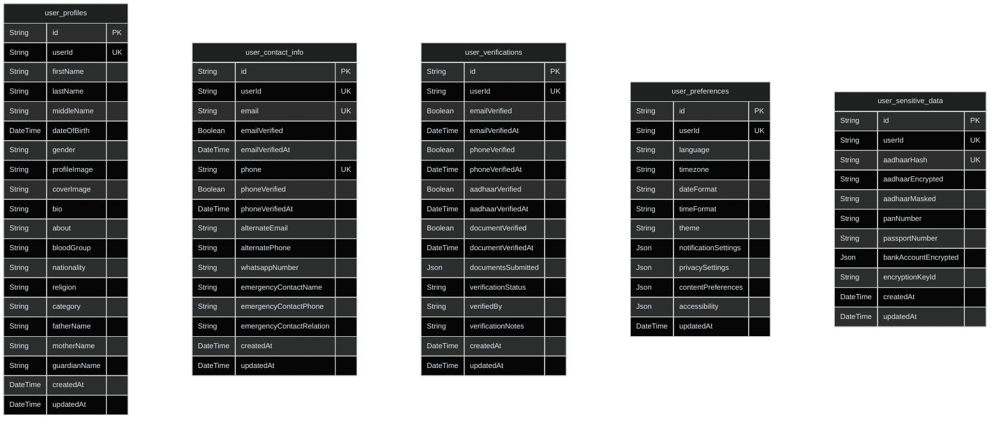
```mermaid
%%{init: {"theme":"dark","themeVariables":{"fontFamily":"Inter, Segoe UI, Arial, sans-serif","background":"#0f172a","primaryColor":"#1e293b","secondaryColor":"#111827","tertiaryColor":"#0b1020","primaryBorderColor":"#8b5cf6","secondaryBorderColor":"#38bdf8","tertiaryBorderColor":"#14b8a6","lineColor":"#8b5cf6","textColor":"#e2e8f0","fontSize":"16px"}}}%%
erDiagram
  %% Source: dbml-modules/03-user-management.dbml
  %% Tables: 5
  %% Internal relationships: 0
  %% Table: user_profiles
  user_profiles {
    String id PK
    String userId UK
    String firstName
    String lastName
    String middleName
    DateTime dateOfBirth
    String gender
    String profileImage
    String coverImage
    String bio
    String about
    String bloodGroup
    String nationality
    String religion
    String category
    String fatherName
    String motherName
    String guardianName
    DateTime createdAt
    DateTime updatedAt
  }
  %% Table: user_contact_info
  user_contact_info {
    String id PK
    String userId UK
    String email UK
    Boolean emailVerified
    DateTime emailVerifiedAt
    String phone UK
    Boolean phoneVerified
    DateTime phoneVerifiedAt
    String alternateEmail
    String alternatePhone
    String whatsappNumber
    String emergencyContactName
    String emergencyContactPhone
    String emergencyContactRelation
    DateTime createdAt
    DateTime updatedAt
  }
  %% Table: user_verifications
  user_verifications {
    String id PK
    String userId UK
    Boolean emailVerified
    DateTime emailVerifiedAt
    Boolean phoneVerified
    DateTime phoneVerifiedAt
    Boolean aadhaarVerified
    DateTime aadhaarVerifiedAt
    Boolean documentVerified
    DateTime documentVerifiedAt
    Json documentsSubmitted
    String verificationStatus
    String verifiedBy
    String verificationNotes
    DateTime createdAt
    DateTime updatedAt
  }
  %% Table: user_preferences
  user_preferences {
    String id PK
    String userId UK
    String language
    String timezone
    String dateFormat
    String timeFormat
    String theme
    Json notificationSettings
    Json privacySettings
    Json contentPreferences
    Json accessibility
    DateTime updatedAt
  }
  %% Table: user_sensitive_data
  user_sensitive_data {
    String id PK
    String userId UK
    String aadhaarHash UK
    String aadhaarEncrypted
    String aadhaarMasked
    String panNumber
    String passportNumber
    Json bankAccountEncrypted
    String encryptionKeyId
    DateTime createdAt
    DateTime updatedAt
  }

  %% No internal relationships in this module

```

## 04-multi-tenancy.dbml

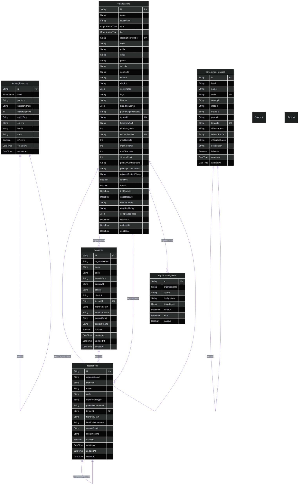
```mermaid
%%{init: {"theme":"dark","themeVariables":{"fontFamily":"Inter, Segoe UI, Arial, sans-serif","background":"#0f172a","primaryColor":"#1e293b","secondaryColor":"#111827","tertiaryColor":"#0b1020","primaryBorderColor":"#8b5cf6","secondaryBorderColor":"#38bdf8","tertiaryBorderColor":"#14b8a6","lineColor":"#8b5cf6","textColor":"#e2e8f0","fontSize":"16px"}}}%%
erDiagram
  %% Source: dbml-modules/04-multi-tenancy.dbml
  %% Tables: 6
  %% Internal relationships: 8
  %% Table: organizations
  organizations {
    String id PK
    String name
    String legalName
    OrganizationType type
    OrganizationTier tier
    String registrationNumber UK
    String taxId
    String gstin
    String email
    String phone
    String website
    String countryId
    String stateId
    String districtId
    Json coordinates
    String logo
    String banner
    Json brandingConfig
    String parentOrganizationId
    String tenantId UK
    String hierarchyPath
    Int hierarchyLevel
    String customDomain UK
    Int maxSchools
    Int maxStudents
    Int maxTeachers
    Int storageLimit
    String primaryContactName
    String primaryContactEmail
    String primaryContactPhone
    Boolean isActive
    Boolean isTrial
    DateTime trialEndsAt
    DateTime onboardedAt
    String onboardedBy
    String dataResidency
    Json complianceFlags
    DateTime createdAt
    DateTime updatedAt
    DateTime deletedAt
  }
  %% Table: branches
  branches {
    String id PK
    String organizationId
    String name
    String code
    String branchType
    String countryId
    String stateId
    String districtId
    String tenantId UK
    String hierarchyPath
    String headOfBranch
    String contactEmail
    String contactPhone
    Boolean isActive
    DateTime createdAt
    DateTime updatedAt
    DateTime deletedAt
  }
  %% Table: departments
  departments {
    String id PK
    String organizationId
    String branchId
    String name
    String code
    String departmentType
    String parentDepartmentId
    String tenantId UK
    String hierarchyPath
    String headOfDepartment
    String contactEmail
    String contactPhone
    Boolean isActive
    DateTime createdAt
    DateTime updatedAt
    DateTime deletedAt
  }
  %% Table: organization_users
  organization_users {
    String id PK
    String organizationId
    String userId
    String designation
    String department
    DateTime joinedAt
    DateTime leftAt
    Boolean isActive
  }
  %% Table: tenant_hierarchy
  tenant_hierarchy {
    String id PK
    TenantLevel level
    String parentId
    String hierarchyPath
    Int hierarchyLevel
    String entityType
    String entityId
    String name
    String code
    Boolean isActive
    DateTime createdAt
    DateTime updatedAt
  }
  %% Table: government_entities
  government_entities {
    String id PK
    String level
    String name
    String code UK
    String countryId
    String stateId
    String districtId
    String parentId
    String tenantId UK
    String contactEmail
    String contactPhone
    String officerInCharge
    String designation
    Boolean isActive
    DateTime createdAt
    DateTime updatedAt
  }

  %% Relationships
  tenant_hierarchy ||--|| tenant_hierarchy : parentId
  government_entities ||--|| government_entities : parentId
  organizations ||--|| organizations : parentOrganizationId
  organizations ||--o{ branches : organizationId Cascade
  organizations ||--o{ departments : organizationId Cascade
  branches ||--o{ departments : branchId Cascade
  departments ||--|| departments : parentDepartmentId Restrict
  organizations ||--o{ organization_users : organizationId Cascade

```

## 05-geography-address.dbml

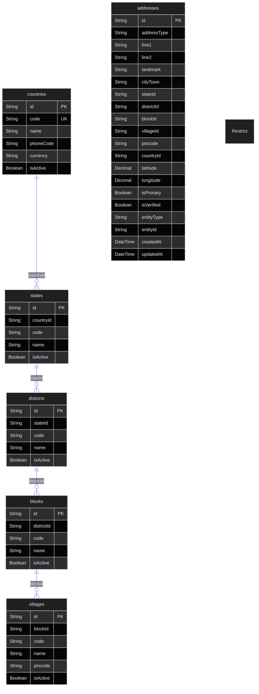
```mermaid
%%{init: {"theme":"dark","themeVariables":{"fontFamily":"Inter, Segoe UI, Arial, sans-serif","background":"#0f172a","primaryColor":"#1e293b","secondaryColor":"#111827","tertiaryColor":"#0b1020","primaryBorderColor":"#8b5cf6","secondaryBorderColor":"#38bdf8","tertiaryBorderColor":"#14b8a6","lineColor":"#8b5cf6","textColor":"#e2e8f0","fontSize":"16px"}}}%%
erDiagram
  %% Source: dbml-modules/05-geography-address.dbml
  %% Tables: 6
  %% Internal relationships: 4
  %% Table: countries
  countries {
    String id PK
    String code UK
    String name
    String phoneCode
    String currency
    Boolean isActive
  }
  %% Table: states
  states {
    String id PK
    String countryId
    String code
    String name
    Boolean isActive
  }
  %% Table: districts
  districts {
    String id PK
    String stateId
    String code
    String name
    Boolean isActive
  }
  %% Table: blocks
  blocks {
    String id PK
    String districtId
    String code
    String name
    Boolean isActive
  }
  %% Table: villages
  villages {
    String id PK
    String blockId
    String code
    String name
    String pincode
    Boolean isActive
  }
  %% Table: addresses
  addresses {
    String id PK
    String addressType
    String line1
    String line2
    String landmark
    String cityTown
    String stateId
    String districtId
    String blockId
    String villageId
    String pincode
    String countryId
    Decimal latitude
    Decimal longitude
    Boolean isPrimary
    Boolean isVerified
    String entityType
    String entityId
    DateTime createdAt
    DateTime updatedAt
  }

  %% Relationships
  countries ||--o{ states : countryId Restrict
  states ||--o{ districts : stateId Restrict
  districts ||--o{ blocks : districtId Restrict
  blocks ||--o{ villages : blockId Restrict

```

## 06-school-structure.dbml

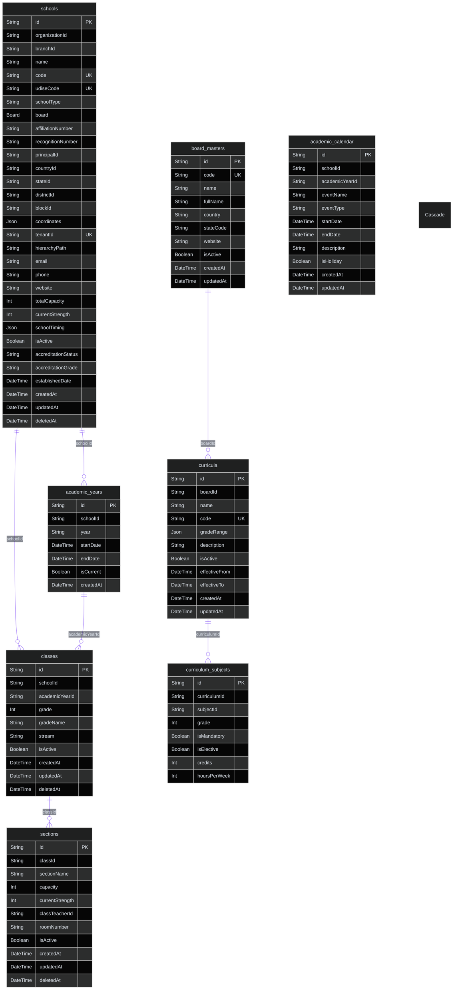
```mermaid
%%{init: {"theme":"dark","themeVariables":{"fontFamily":"Inter, Segoe UI, Arial, sans-serif","background":"#0f172a","primaryColor":"#1e293b","secondaryColor":"#111827","tertiaryColor":"#0b1020","primaryBorderColor":"#8b5cf6","secondaryBorderColor":"#38bdf8","tertiaryBorderColor":"#14b8a6","lineColor":"#8b5cf6","textColor":"#e2e8f0","fontSize":"16px"}}}%%
erDiagram
  %% Source: dbml-modules/06-school-structure.dbml
  %% Tables: 8
  %% Internal relationships: 6
  %% Table: schools
  schools {
    String id PK
    String organizationId
    String branchId
    String name
    String code UK
    String udiseCode UK
    String schoolType
    Board board
    String affiliationNumber
    String recognitionNumber
    String principalId
    String countryId
    String stateId
    String districtId
    String blockId
    Json coordinates
    String tenantId UK
    String hierarchyPath
    String email
    String phone
    String website
    Int totalCapacity
    Int currentStrength
    Json schoolTiming
    Boolean isActive
    String accreditationStatus
    String accreditationGrade
    DateTime establishedDate
    DateTime createdAt
    DateTime updatedAt
    DateTime deletedAt
  }
  %% Table: academic_years
  academic_years {
    String id PK
    String schoolId
    String year
    DateTime startDate
    DateTime endDate
    Boolean isCurrent
    DateTime createdAt
  }
  %% Table: classes
  classes {
    String id PK
    String schoolId
    String academicYearId
    Int grade
    String gradeName
    String stream
    Boolean isActive
    DateTime createdAt
    DateTime updatedAt
    DateTime deletedAt
  }
  %% Table: sections
  sections {
    String id PK
    String classId
    String sectionName
    Int capacity
    Int currentStrength
    String classTeacherId
    String roomNumber
    Boolean isActive
    DateTime createdAt
    DateTime updatedAt
    DateTime deletedAt
  }
  %% Table: board_masters
  board_masters {
    String id PK
    String code UK
    String name
    String fullName
    String country
    String stateCode
    String website
    Boolean isActive
    DateTime createdAt
    DateTime updatedAt
  }
  %% Table: curricula
  curricula {
    String id PK
    String boardId
    String name
    String code UK
    Json gradeRange
    String description
    Boolean isActive
    DateTime effectiveFrom
    DateTime effectiveTo
    DateTime createdAt
    DateTime updatedAt
  }
  %% Table: curriculum_subjects
  curriculum_subjects {
    String id PK
    String curriculumId
    String subjectId
    Int grade
    Boolean isMandatory
    Boolean isElective
    Int credits
    Int hoursPerWeek
  }
  %% Table: academic_calendar
  academic_calendar {
    String id PK
    String schoolId
    String academicYearId
    String eventName
    String eventType
    DateTime startDate
    DateTime endDate
    String description
    Boolean isHoliday
    DateTime createdAt
    DateTime updatedAt
  }

  %% Relationships
  board_masters ||--o{ curricula : boardId Cascade
  curricula ||--o{ curriculum_subjects : curriculumId Cascade
  schools ||--o{ academic_years : schoolId Cascade
  schools ||--o{ classes : schoolId Cascade
  academic_years ||--o{ classes : academicYearId Cascade
  classes ||--o{ sections : classId Cascade

```

## 07-subjects-curriculum.dbml

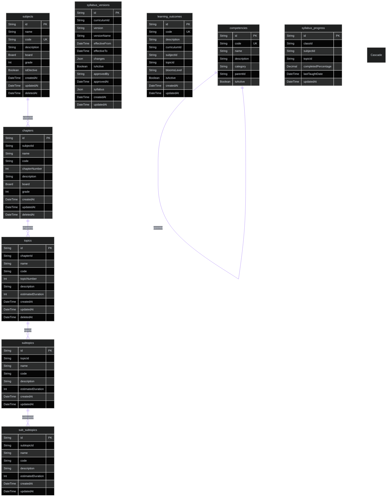
```mermaid
%%{init: {"theme":"dark","themeVariables":{"fontFamily":"Inter, Segoe UI, Arial, sans-serif","background":"#0f172a","primaryColor":"#1e293b","secondaryColor":"#111827","tertiaryColor":"#0b1020","primaryBorderColor":"#8b5cf6","secondaryBorderColor":"#38bdf8","tertiaryBorderColor":"#14b8a6","lineColor":"#8b5cf6","textColor":"#e2e8f0","fontSize":"16px"}}}%%
erDiagram
  %% Source: dbml-modules/07-subjects-curriculum.dbml
  %% Tables: 9
  %% Internal relationships: 5
  %% Table: subjects
  subjects {
    String id PK
    String name
    String code UK
    String description
    Board board
    Int grade
    Boolean isElective
    DateTime createdAt
    DateTime updatedAt
    DateTime deletedAt
  }
  %% Table: chapters
  chapters {
    String id PK
    String subjectId
    String name
    String code
    Int chapterNumber
    String description
    Board board
    Int grade
    DateTime createdAt
    DateTime updatedAt
    DateTime deletedAt
  }
  %% Table: topics
  topics {
    String id PK
    String chapterId
    String name
    String code
    Int topicNumber
    String description
    Int estimatedDuration
    DateTime createdAt
    DateTime updatedAt
    DateTime deletedAt
  }
  %% Table: subtopics
  subtopics {
    String id PK
    String topicId
    String name
    String code
    String description
    Int estimatedDuration
    DateTime createdAt
    DateTime updatedAt
  }
  %% Table: sub_subtopics
  sub_subtopics {
    String id PK
    String subtopicId
    String name
    String code
    String description
    Int estimatedDuration
    DateTime createdAt
    DateTime updatedAt
  }
  %% Table: syllabus_versions
  syllabus_versions {
    String id PK
    String curriculumId
    String version
    String versionName
    DateTime effectiveFrom
    DateTime effectiveTo
    Json changes
    Boolean isActive
    String approvedBy
    DateTime approvedAt
    Json syllabus
    DateTime createdAt
    DateTime updatedAt
  }
  %% Table: learning_outcomes
  learning_outcomes {
    String id PK
    String code UK
    String description
    String curriculumId
    String subjectId
    String topicId
    String bloomsLevel
    Boolean isActive
    DateTime createdAt
    DateTime updatedAt
  }
  %% Table: competencies
  competencies {
    String id PK
    String code UK
    String name
    String description
    String category
    String parentId
    Boolean isActive
  }
  %% Table: syllabus_progress
  syllabus_progress {
    String id PK
    String classId
    String subjectId
    String topicId
    Decimal completedPercentage
    DateTime lastTaughtDate
    DateTime updatedAt
  }

  %% Relationships
  subjects ||--o{ chapters : subjectId Cascade
  chapters ||--o{ topics : chapterId Cascade
  topics ||--o{ subtopics : topicId Cascade
  subtopics ||--o{ sub_subtopics : subtopicId Cascade
  competencies ||--|| competencies : parentId

```

## 08-student-teacher.dbml

```mermaid
%%{init: {"theme":"dark","themeVariables":{"fontFamily":"Inter, Segoe UI, Arial, sans-serif","background":"#0f172a","primaryColor":"#1e293b","secondaryColor":"#111827","tertiaryColor":"#0b1020","primaryBorderColor":"#8b5cf6","secondaryBorderColor":"#38bdf8","tertiaryBorderColor":"#14b8a6","lineColor":"#8b5cf6","textColor":"#e2e8f0","fontSize":"16px"}}}%%
erDiagram
  %% Source: dbml-modules/08-student-teacher.dbml
  %% Tables: 11
  %% Internal relationships: 4
  %% Table: student_profiles
  student_profiles {
    String id PK
    String userId UK
    String schoolId
    String rollNumber
    String admissionNumber UK
    DateTime admissionDate
    String bloodGroup
    Json emergencyContact
    String previousSchool
    Boolean transportOpted
    Boolean hostelOpted
    DateTime createdAt
    DateTime updatedAt
  }
  %% Table: teacher_profiles
  teacher_profiles {
    String id PK
    String userId UK
    String schoolId
    String employeeId UK
    String designation
    String qualification
    Int experience
    DateTime joiningDate
    DateTime leavingDate
    Decimal salary
    Boolean isActive
    DateTime createdAt
    DateTime updatedAt
  }
  %% Table: parent_profiles
  parent_profiles {
    String id PK
    String userId UK
    String occupation
    DateTime createdAt
    DateTime updatedAt
  }
  %% Table: publisher_profiles
  publisher_profiles {
    String id PK
    String userId UK
    String companyName
    String registrationNumber UK
    String taxId
    String website
    String description
    Boolean isVerified
    DateTime verifiedAt
    Boolean termsAccepted
    DateTime termsAcceptedAt
    Json bankDetails
    DateTime createdAt
    DateTime updatedAt
  }
  %% Table: creator_profiles
  creator_profiles {
    String id PK
    String userId UK
    String displayName
    String bio
    Boolean isVerified
    DateTime verifiedAt
    Boolean termsAccepted
    DateTime termsAcceptedAt
    Json bankDetails
    Decimal totalEarnings
    DateTime createdAt
    DateTime updatedAt
  }
  %% Table: student_enrollments
  student_enrollments {
    String id PK
    String studentId
    String sectionId
    String academicYearId
    DateTime enrollmentDate
    String status
    String rollNumber
    DateTime createdAt
    DateTime updatedAt
  }
  %% Table: class_subjects
  class_subjects {
    String id PK
    String classId
    String subjectId
    String teacherId
    Boolean isActive
  }
  %% Table: section_teachers
  section_teachers {
    String id PK
    String sectionId
    String teacherId
    String subjectId
    Boolean isPrimary
    DateTime assignedAt
    String assignedBy
  }
  %% Table: section_subjects
  section_subjects {
    String id PK
    String sectionId
    String subjectId
    String teacherId
    Int periodsPerWeek
    Boolean isActive
  }
  %% Table: parent_students
  parent_students {
    String id PK
    String parentId
    String studentId
    String relationship
    Boolean isPrimary
    DateTime createdAt
  }
  %% Table: student_groups
  student_groups {
    String id PK
    String schoolId
    String groupName
    String groupType
    String color
    String motto
    String emblem
    String captainId
    String viceCaptainId
    Int points
    Boolean isActive
    DateTime createdAt
    DateTime updatedAt
  }

  %% Relationships
  teacher_profiles ||--o{ class_subjects : teacherId
  parent_profiles ||--o{ parent_students : parentId Cascade
  student_profiles ||--o{ parent_students : studentId Cascade
  student_profiles ||--o{ student_enrollments : studentId Cascade

```

## 09-timetable-rooms.dbml

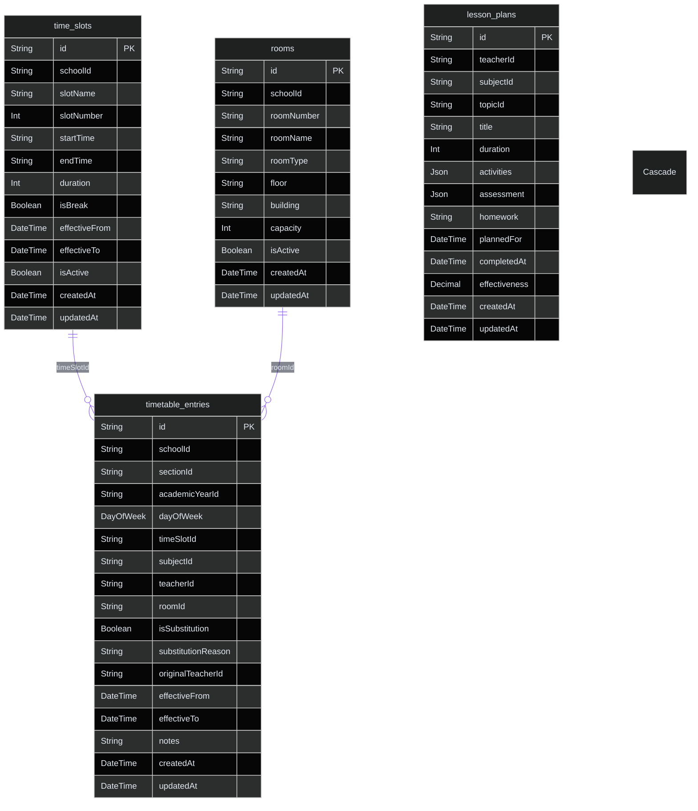
```mermaid
%%{init: {"theme":"dark","themeVariables":{"fontFamily":"Inter, Segoe UI, Arial, sans-serif","background":"#0f172a","primaryColor":"#1e293b","secondaryColor":"#111827","tertiaryColor":"#0b1020","primaryBorderColor":"#8b5cf6","secondaryBorderColor":"#38bdf8","tertiaryBorderColor":"#14b8a6","lineColor":"#8b5cf6","textColor":"#e2e8f0","fontSize":"16px"}}}%%
erDiagram
  %% Source: dbml-modules/09-timetable-rooms.dbml
  %% Tables: 4
  %% Internal relationships: 2
  %% Table: rooms
  rooms {
    String id PK
    String schoolId
    String roomNumber
    String roomName
    String roomType
    String floor
    String building
    Int capacity
    Boolean isActive
    DateTime createdAt
    DateTime updatedAt
  }
  %% Table: time_slots
  time_slots {
    String id PK
    String schoolId
    String slotName
    Int slotNumber
    String startTime
    String endTime
    Int duration
    Boolean isBreak
    DateTime effectiveFrom
    DateTime effectiveTo
    Boolean isActive
    DateTime createdAt
    DateTime updatedAt
  }
  %% Table: timetable_entries
  timetable_entries {
    String id PK
    String schoolId
    String sectionId
    String academicYearId
    DayOfWeek dayOfWeek
    String timeSlotId
    String subjectId
    String teacherId
    String roomId
    Boolean isSubstitution
    String substitutionReason
    String originalTeacherId
    DateTime effectiveFrom
    DateTime effectiveTo
    String notes
    DateTime createdAt
    DateTime updatedAt
  }
  %% Table: lesson_plans
  lesson_plans {
    String id PK
    String teacherId
    String subjectId
    String topicId
    String title
    Int duration
    Json activities
    Json assessment
    String homework
    DateTime plannedFor
    DateTime completedAt
    Decimal effectiveness
    DateTime createdAt
    DateTime updatedAt
  }

  %% Relationships
  time_slots ||--o{ timetable_entries : timeSlotId Cascade
  rooms ||--o{ timetable_entries : roomId

```

## 10-attendance.dbml

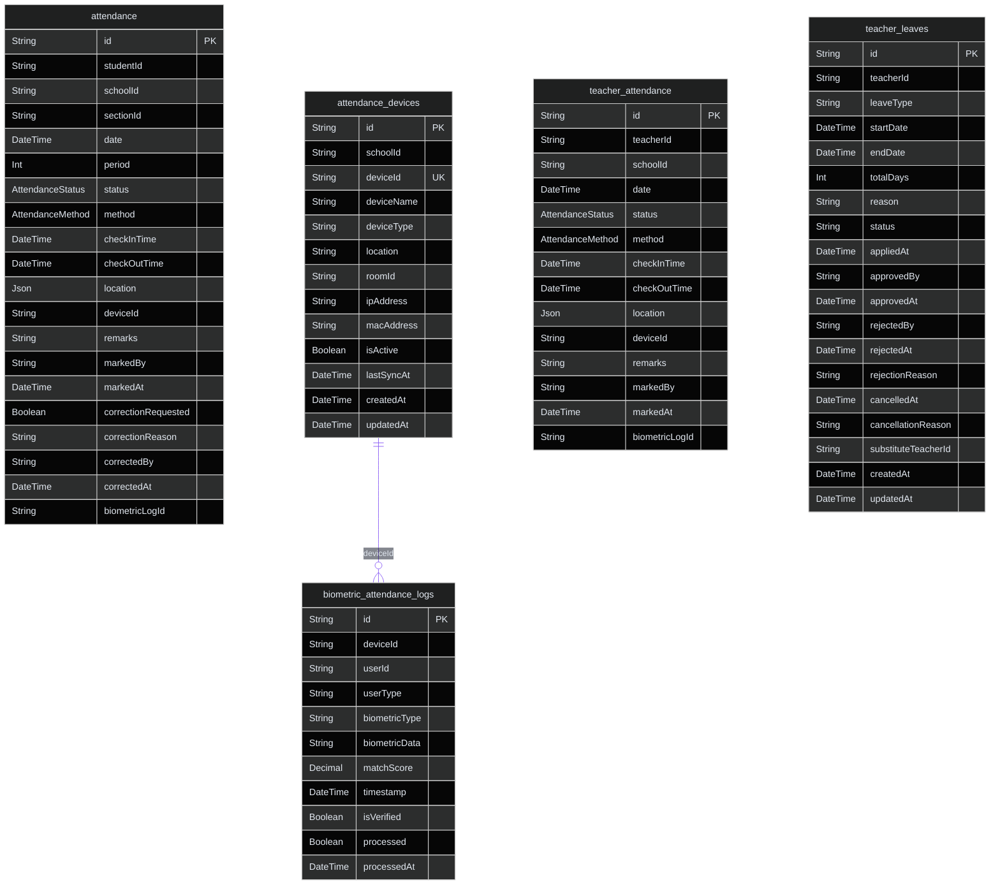
```mermaid
%%{init: {"theme":"dark","themeVariables":{"fontFamily":"Inter, Segoe UI, Arial, sans-serif","background":"#0f172a","primaryColor":"#1e293b","secondaryColor":"#111827","tertiaryColor":"#0b1020","primaryBorderColor":"#8b5cf6","secondaryBorderColor":"#38bdf8","tertiaryBorderColor":"#14b8a6","lineColor":"#8b5cf6","textColor":"#e2e8f0","fontSize":"16px"}}}%%
erDiagram
  %% Source: dbml-modules/10-attendance.dbml
  %% Tables: 5
  %% Internal relationships: 1
  %% Table: attendance
  attendance {
    String id PK
    String studentId
    String schoolId
    String sectionId
    DateTime date
    Int period
    AttendanceStatus status
    AttendanceMethod method
    DateTime checkInTime
    DateTime checkOutTime
    Json location
    String deviceId
    String remarks
    String markedBy
    DateTime markedAt
    Boolean correctionRequested
    String correctionReason
    String correctedBy
    DateTime correctedAt
    String biometricLogId
  }
  %% Table: attendance_devices
  attendance_devices {
    String id PK
    String schoolId
    String deviceId UK
    String deviceName
    String deviceType
    String location
    String roomId
    String ipAddress
    String macAddress
    Boolean isActive
    DateTime lastSyncAt
    DateTime createdAt
    DateTime updatedAt
  }
  %% Table: biometric_attendance_logs
  biometric_attendance_logs {
    String id PK
    String deviceId
    String userId
    String userType
    String biometricType
    String biometricData
    Decimal matchScore
    DateTime timestamp
    Boolean isVerified
    Boolean processed
    DateTime processedAt
  }
  %% Table: teacher_attendance
  teacher_attendance {
    String id PK
    String teacherId
    String schoolId
    DateTime date
    AttendanceStatus status
    AttendanceMethod method
    DateTime checkInTime
    DateTime checkOutTime
    Json location
    String deviceId
    String remarks
    String markedBy
    DateTime markedAt
    String biometricLogId
  }
  %% Table: teacher_leaves
  teacher_leaves {
    String id PK
    String teacherId
    String leaveType
    DateTime startDate
    DateTime endDate
    Int totalDays
    String reason
    String status
    DateTime appliedAt
    String approvedBy
    DateTime approvedAt
    String rejectedBy
    DateTime rejectedAt
    String rejectionReason
    DateTime cancelledAt
    String cancellationReason
    String substituteTeacherId
    DateTime createdAt
    DateTime updatedAt
  }

  %% Relationships
  attendance_devices ||--o{ biometric_attendance_logs : deviceId

```

## 11-content-media.dbml

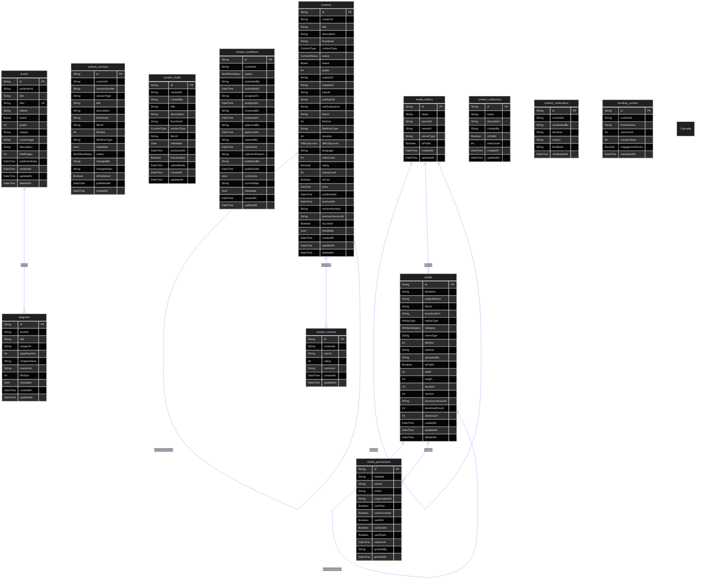
```mermaid
%%{init: {"theme":"dark","themeVariables":{"fontFamily":"Inter, Segoe UI, Arial, sans-serif","background":"#0f172a","primaryColor":"#1e293b","secondaryColor":"#111827","tertiaryColor":"#0b1020","primaryBorderColor":"#8b5cf6","secondaryBorderColor":"#38bdf8","tertiaryBorderColor":"#14b8a6","lineColor":"#8b5cf6","textColor":"#e2e8f0","fontSize":"16px"}}}%%
erDiagram
  %% Source: dbml-modules/11-content-media.dbml
  %% Tables: 13
  %% Internal relationships: 7
  %% Table: contents
  contents {
    String id PK
    String creatorId
    String title
    String description
    String thumbnail
    ContentType contentType
    ContentStatus status
    Board board
    Int grade
    String subjectId
    String chapterId
    String topicId
    String subtopicId
    String subSubtopicId
    String fileUrl
    Int fileSize
    String fileMimeType
    Int duration
    DifficultyLevel difficultyLevel
    String language
    Int viewCount
    Decimal rating
    Int ratingCount
    Boolean isFree
    Decimal price
    DateTime publishedAt
    DateTime archivedAt
    String versionNumber
    String previousVersionId
    Boolean isLocked
    Json metadata
    DateTime createdAt
    DateTime updatedAt
    DateTime deletedAt
  }
  %% Table: content_versions
  content_versions {
    String id PK
    String contentId
    String versionNumber
    String versionType
    String title
    String description
    String thumbnail
    String fileUrl
    Int fileSize
    String fileMimeType
    Json metadata
    WorkflowStatus status
    String changedBy
    String changeNotes
    Boolean isPublished
    DateTime publishedAt
    DateTime createdAt
  }
  %% Table: content_drafts
  content_drafts {
    String id PK
    String contentId
    String createdBy
    String title
    String description
    String thumbnail
    ContentType contentType
    String fileUrl
    Json metadata
    DateTime lastSavedAt
    Boolean isSubmitted
    DateTime submittedAt
    DateTime createdAt
    DateTime updatedAt
  }
  %% Table: content_workflows
  content_workflows {
    String id PK
    String contentId
    WorkflowStatus status
    String submittedBy
    DateTime submittedAt
    String assignedTo
    DateTime assignedAt
    String reviewedBy
    DateTime reviewedAt
    String approvedBy
    DateTime approvedAt
    String rejectedBy
    DateTime rejectedAt
    String rejectionReason
    String publishedBy
    DateTime publishedAt
    Json comments
    String currentStep
    Json metadata
    DateTime createdAt
    DateTime updatedAt
  }
  %% Table: books
  books {
    String id PK
    String publisherId
    String title
    String isbn UK
    String edition
    Board board
    Int grade
    String subject
    String coverImage
    String description
    Int totalPages
    DateTime publishedDate
    DateTime createdAt
    DateTime updatedAt
    DateTime deletedAt
  }
  %% Table: diagrams
  diagrams {
    String id PK
    String bookId
    String title
    String imageUrl
    Int pageNumber
    String chapterName
    String resolution
    Int fileSize
    Json metadata
    DateTime createdAt
    DateTime updatedAt
  }
  %% Table: media
  media {
    String id PK
    String fileName
    String originalName
    String fileUrl
    String thumbnailUrl
    MediaType mediaType
    MediaCategory category
    String mimeType
    Int fileSize
    String folderId
    String uploadedBy
    Boolean isPublic
    Int width
    Int height
    Int duration
    Int version
    String previousVersionId
    Int downloadCount
    Int viewCount
    DateTime createdAt
    DateTime updatedAt
    DateTime deletedAt
  }
  %% Table: media_folders
  media_folders {
    String id PK
    String name
    String parentId
    String ownerId
    String ownerType
    Boolean isPublic
    DateTime createdAt
    DateTime updatedAt
  }
  %% Table: media_permissions
  media_permissions {
    String id PK
    String mediaId
    String userId
    String roleId
    String organizationId
    Boolean canView
    Boolean canDownload
    Boolean canEdit
    Boolean canDelete
    Boolean canShare
    DateTime expiresAt
    String grantedBy
    DateTime grantedAt
  }
  %% Table: content_reviews
  content_reviews {
    String id PK
    String contentId
    String userId
    Int rating
    String comment
    DateTime createdAt
    DateTime updatedAt
  }
  %% Table: content_collections
  content_collections {
    String id PK
    String name
    String description
    String createdBy
    Boolean isPublic
    Int viewCount
    DateTime createdAt
    DateTime updatedAt
  }
  %% Table: content_moderation
  content_moderation {
    String id PK
    String contentId
    String moderatedBy
    String decision
    String reason
    String feedback
    DateTime moderatedAt
  }
  %% Table: trending_content
  trending_content {
    String id PK
    String contentId
    String timeWindow
    Int viewCount
    Int uniqueViews
    Decimal engagementScore
    DateTime calculatedAt
  }

  %% Relationships
  contents ||--|| contents : previousVersionId
  contents ||--o{ content_reviews : contentId Cascade
  books ||--o{ diagrams : bookId Cascade
  media_folders ||--|| media_folders : parentId
  media_folders ||--o{ media : folderId
  media ||--|| media : previousVersionId
  media ||--o{ media_permissions : mediaId Cascade

```

## 12-assessment-exams.dbml

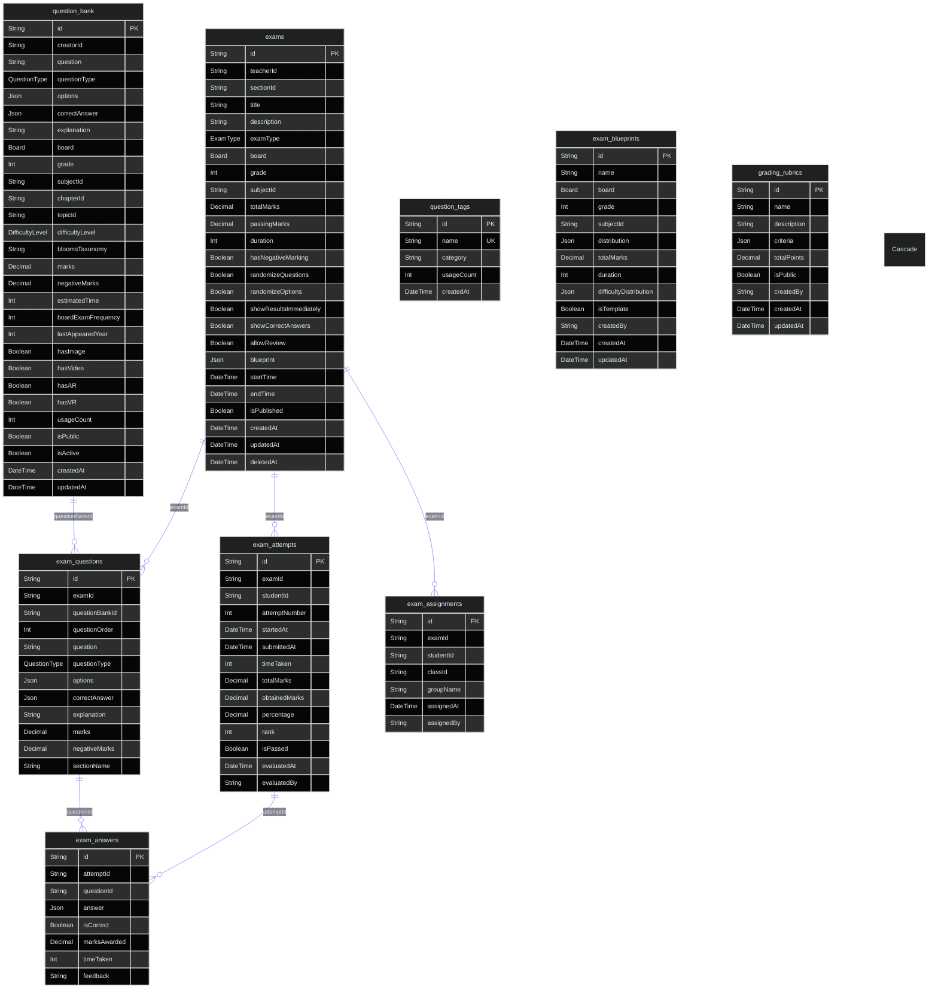
```mermaid
%%{init: {"theme":"dark","themeVariables":{"fontFamily":"Inter, Segoe UI, Arial, sans-serif","background":"#0f172a","primaryColor":"#1e293b","secondaryColor":"#111827","tertiaryColor":"#0b1020","primaryBorderColor":"#8b5cf6","secondaryBorderColor":"#38bdf8","tertiaryBorderColor":"#14b8a6","lineColor":"#8b5cf6","textColor":"#e2e8f0","fontSize":"16px"}}}%%
erDiagram
  %% Source: dbml-modules/12-assessment-exams.dbml
  %% Tables: 9
  %% Internal relationships: 6
  %% Table: exams
  exams {
    String id PK
    String teacherId
    String sectionId
    String title
    String description
    ExamType examType
    Board board
    Int grade
    String subjectId
    Decimal totalMarks
    Decimal passingMarks
    Int duration
    Boolean hasNegativeMarking
    Boolean randomizeQuestions
    Boolean randomizeOptions
    Boolean showResultsImmediately
    Boolean showCorrectAnswers
    Boolean allowReview
    Json blueprint
    DateTime startTime
    DateTime endTime
    Boolean isPublished
    DateTime createdAt
    DateTime updatedAt
    DateTime deletedAt
  }
  %% Table: exam_questions
  exam_questions {
    String id PK
    String examId
    String questionBankId
    Int questionOrder
    String question
    QuestionType questionType
    Json options
    Json correctAnswer
    String explanation
    Decimal marks
    Decimal negativeMarks
    String sectionName
  }
  %% Table: exam_answers
  exam_answers {
    String id PK
    String attemptId
    String questionId
    Json answer
    Boolean isCorrect
    Decimal marksAwarded
    Int timeTaken
    String feedback
  }
  %% Table: exam_attempts
  exam_attempts {
    String id PK
    String examId
    String studentId
    Int attemptNumber
    DateTime startedAt
    DateTime submittedAt
    Int timeTaken
    Decimal totalMarks
    Decimal obtainedMarks
    Decimal percentage
    Int rank
    Boolean isPassed
    DateTime evaluatedAt
    String evaluatedBy
  }
  %% Table: exam_assignments
  exam_assignments {
    String id PK
    String examId
    String studentId
    String classId
    String groupName
    DateTime assignedAt
    String assignedBy
  }
  %% Table: question_bank
  question_bank {
    String id PK
    String creatorId
    String question
    QuestionType questionType
    Json options
    Json correctAnswer
    String explanation
    Board board
    Int grade
    String subjectId
    String chapterId
    String topicId
    DifficultyLevel difficultyLevel
    String bloomsTaxonomy
    Decimal marks
    Decimal negativeMarks
    Int estimatedTime
    Int boardExamFrequency
    Int lastAppearedYear
    Boolean hasImage
    Boolean hasVideo
    Boolean hasAR
    Boolean hasVR
    Int usageCount
    Boolean isPublic
    Boolean isActive
    DateTime createdAt
    DateTime updatedAt
  }
  %% Table: question_tags
  question_tags {
    String id PK
    String name UK
    String category
    Int usageCount
    DateTime createdAt
  }
  %% Table: exam_blueprints
  exam_blueprints {
    String id PK
    String name
    Board board
    Int grade
    String subjectId
    Json distribution
    Decimal totalMarks
    Int duration
    Json difficultyDistribution
    Boolean isTemplate
    String createdBy
    DateTime createdAt
    DateTime updatedAt
  }
  %% Table: grading_rubrics
  grading_rubrics {
    String id PK
    String name
    String description
    Json criteria
    Decimal totalPoints
    Boolean isPublic
    String createdBy
    DateTime createdAt
    DateTime updatedAt
  }

  %% Relationships
  exams ||--o{ exam_questions : examId Cascade
  question_bank ||--o{ exam_questions : questionBankId
  exams ||--o{ exam_assignments : examId Cascade
  exams ||--o{ exam_attempts : examId Cascade
  exam_attempts ||--o{ exam_answers : attemptId Cascade
  exam_questions ||--o{ exam_answers : questionId Cascade

```

## 13-assignments-grades.dbml

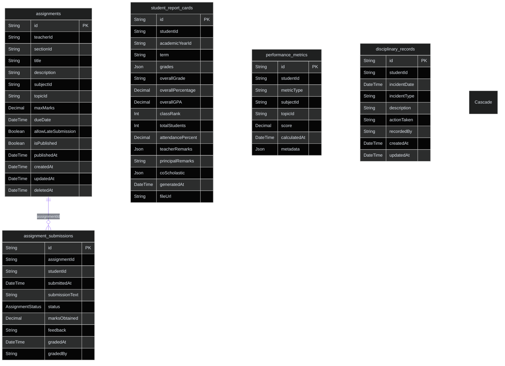
```mermaid
%%{init: {"theme":"dark","themeVariables":{"fontFamily":"Inter, Segoe UI, Arial, sans-serif","background":"#0f172a","primaryColor":"#1e293b","secondaryColor":"#111827","tertiaryColor":"#0b1020","primaryBorderColor":"#8b5cf6","secondaryBorderColor":"#38bdf8","tertiaryBorderColor":"#14b8a6","lineColor":"#8b5cf6","textColor":"#e2e8f0","fontSize":"16px"}}}%%
erDiagram
  %% Source: dbml-modules/13-assignments-grades.dbml
  %% Tables: 5
  %% Internal relationships: 1
  %% Table: assignments
  assignments {
    String id PK
    String teacherId
    String sectionId
    String title
    String description
    String subjectId
    String topicId
    Decimal maxMarks
    DateTime dueDate
    Boolean allowLateSubmission
    Boolean isPublished
    DateTime publishedAt
    DateTime createdAt
    DateTime updatedAt
    DateTime deletedAt
  }
  %% Table: assignment_submissions
  assignment_submissions {
    String id PK
    String assignmentId
    String studentId
    DateTime submittedAt
    String submissionText
    AssignmentStatus status
    Decimal marksObtained
    String feedback
    DateTime gradedAt
    String gradedBy
  }
  %% Table: student_report_cards
  student_report_cards {
    String id PK
    String studentId
    String academicYearId
    String term
    Json grades
    String overallGrade
    Decimal overallPercentage
    Decimal overallGPA
    Int classRank
    Int totalStudents
    Decimal attendancePercent
    Json teacherRemarks
    String principalRemarks
    Json coScholastic
    DateTime generatedAt
    String fileUrl
  }
  %% Table: performance_metrics
  performance_metrics {
    String id PK
    String studentId
    String metricType
    String subjectId
    String topicId
    Decimal score
    DateTime calculatedAt
    Json metadata
  }
  %% Table: disciplinary_records
  disciplinary_records {
    String id PK
    String studentId
    DateTime incidentDate
    String incidentType
    String description
    String actionTaken
    String recordedBy
    DateTime createdAt
    DateTime updatedAt
  }

  %% Relationships
  assignments ||--o{ assignment_submissions : assignmentId Cascade

```

## 14-arvr-learning.dbml

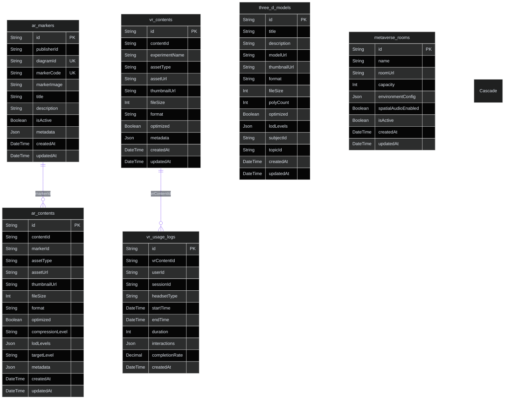
```mermaid
%%{init: {"theme":"dark","themeVariables":{"fontFamily":"Inter, Segoe UI, Arial, sans-serif","background":"#0f172a","primaryColor":"#1e293b","secondaryColor":"#111827","tertiaryColor":"#0b1020","primaryBorderColor":"#8b5cf6","secondaryBorderColor":"#38bdf8","tertiaryBorderColor":"#14b8a6","lineColor":"#8b5cf6","textColor":"#e2e8f0","fontSize":"16px"}}}%%
erDiagram
  %% Source: dbml-modules/14-arvr-learning.dbml
  %% Tables: 6
  %% Internal relationships: 2
  %% Table: ar_markers
  ar_markers {
    String id PK
    String publisherId
    String diagramId UK
    String markerCode UK
    String markerImage
    String title
    String description
    Boolean isActive
    Json metadata
    DateTime createdAt
    DateTime updatedAt
  }
  %% Table: ar_contents
  ar_contents {
    String id PK
    String contentId
    String markerId
    String assetType
    String assetUrl
    String thumbnailUrl
    Int fileSize
    String format
    Boolean optimized
    String compressionLevel
    Json lodLevels
    String targetLevel
    Json metadata
    DateTime createdAt
    DateTime updatedAt
  }
  %% Table: vr_contents
  vr_contents {
    String id PK
    String contentId
    String experimentName
    String assetType
    String assetUrl
    String thumbnailUrl
    Int fileSize
    String format
    Boolean optimized
    Json metadata
    DateTime createdAt
    DateTime updatedAt
  }
  %% Table: vr_usage_logs
  vr_usage_logs {
    String id PK
    String vrContentId
    String userId
    String sessionId
    String headsetType
    DateTime startTime
    DateTime endTime
    Int duration
    Json interactions
    Decimal completionRate
    DateTime createdAt
  }
  %% Table: three_d_models
  three_d_models {
    String id PK
    String title
    String description
    String modelUrl
    String thumbnailUrl
    String format
    Int fileSize
    Int polyCount
    Boolean optimized
    Json lodLevels
    String subjectId
    String topicId
    DateTime createdAt
    DateTime updatedAt
  }
  %% Table: metaverse_rooms
  metaverse_rooms {
    String id PK
    String name
    String roomUrl
    Int capacity
    Json environmentConfig
    Boolean spatialAudioEnabled
    Boolean isActive
    DateTime createdAt
    DateTime updatedAt
  }

  %% Relationships
  ar_markers ||--o{ ar_contents : markerId
  vr_contents ||--o{ vr_usage_logs : vrContentId Cascade

```

## 15-live-classes.dbml

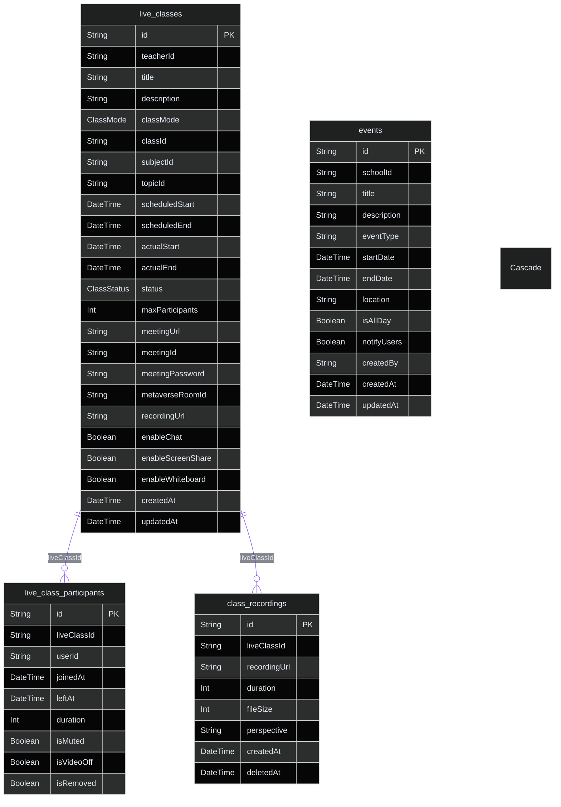
```mermaid
%%{init: {"theme":"dark","themeVariables":{"fontFamily":"Inter, Segoe UI, Arial, sans-serif","background":"#0f172a","primaryColor":"#1e293b","secondaryColor":"#111827","tertiaryColor":"#0b1020","primaryBorderColor":"#8b5cf6","secondaryBorderColor":"#38bdf8","tertiaryBorderColor":"#14b8a6","lineColor":"#8b5cf6","textColor":"#e2e8f0","fontSize":"16px"}}}%%
erDiagram
  %% Source: dbml-modules/15-live-classes.dbml
  %% Tables: 4
  %% Internal relationships: 2
  %% Table: live_classes
  live_classes {
    String id PK
    String teacherId
    String title
    String description
    ClassMode classMode
    String classId
    String subjectId
    String topicId
    DateTime scheduledStart
    DateTime scheduledEnd
    DateTime actualStart
    DateTime actualEnd
    ClassStatus status
    Int maxParticipants
    String meetingUrl
    String meetingId
    String meetingPassword
    String metaverseRoomId
    String recordingUrl
    Boolean enableChat
    Boolean enableScreenShare
    Boolean enableWhiteboard
    DateTime createdAt
    DateTime updatedAt
  }
  %% Table: live_class_participants
  live_class_participants {
    String id PK
    String liveClassId
    String userId
    DateTime joinedAt
    DateTime leftAt
    Int duration
    Boolean isMuted
    Boolean isVideoOff
    Boolean isRemoved
  }
  %% Table: class_recordings
  class_recordings {
    String id PK
    String liveClassId
    String recordingUrl
    Int duration
    Int fileSize
    String perspective
    DateTime createdAt
    DateTime deletedAt
  }
  %% Table: events
  events {
    String id PK
    String schoolId
    String title
    String description
    String eventType
    DateTime startDate
    DateTime endDate
    String location
    Boolean isAllDay
    Boolean notifyUsers
    String createdBy
    DateTime createdAt
    DateTime updatedAt
  }

  %% Relationships
  live_classes ||--o{ live_class_participants : liveClassId Cascade
  live_classes ||--o{ class_recordings : liveClassId Cascade

```

## 16-fee-management.dbml

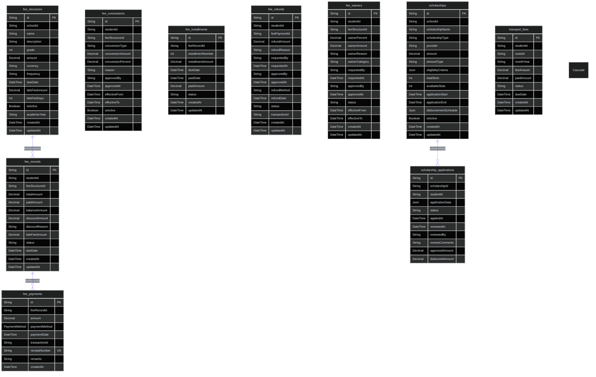
```mermaid
%%{init: {"theme":"dark","themeVariables":{"fontFamily":"Inter, Segoe UI, Arial, sans-serif","background":"#0f172a","primaryColor":"#1e293b","secondaryColor":"#111827","tertiaryColor":"#0b1020","primaryBorderColor":"#8b5cf6","secondaryBorderColor":"#38bdf8","tertiaryBorderColor":"#14b8a6","lineColor":"#8b5cf6","textColor":"#e2e8f0","fontSize":"16px"}}}%%
erDiagram
  %% Source: dbml-modules/16-fee-management.dbml
  %% Tables: 10
  %% Internal relationships: 3
  %% Table: fee_structures
  fee_structures {
    String id PK
    String schoolId
    String name
    String description
    Int grade
    Decimal amount
    String currency
    String frequency
    DateTime dueDate
    Decimal lateFeeAmount
    Int lateFeeDays
    Boolean isActive
    String academicYear
    DateTime createdAt
    DateTime updatedAt
  }
  %% Table: fee_records
  fee_records {
    String id PK
    String studentId
    String feeStructureId
    Decimal totalAmount
    Decimal paidAmount
    Decimal balanceAmount
    Decimal discountAmount
    String discountReason
    Decimal lateFeeAmount
    String status
    DateTime dueDate
    DateTime createdAt
    DateTime updatedAt
  }
  %% Table: fee_payments
  fee_payments {
    String id PK
    String feeRecordId
    Decimal amount
    PaymentMethod paymentMethod
    DateTime paymentDate
    String transactionId
    String receiptNumber UK
    String remarks
    DateTime createdAt
  }
  %% Table: fee_concessions
  fee_concessions {
    String id PK
    String studentId
    String feeStructureId
    String concessionType
    Decimal concessionAmount
    Decimal concessionPercent
    String reason
    String approvedBy
    DateTime approvedAt
    DateTime effectiveFrom
    DateTime effectiveTo
    Boolean isActive
    DateTime createdAt
    DateTime updatedAt
  }
  %% Table: fee_installments
  fee_installments {
    String id PK
    String feeRecordId
    Int installmentNumber
    Decimal installmentAmount
    DateTime dueDate
    DateTime paidDate
    Decimal paidAmount
    String status
    DateTime createdAt
    DateTime updatedAt
  }
  %% Table: fee_refunds
  fee_refunds {
    String id PK
    String studentId
    String feePaymentId
    Decimal refundAmount
    String refundReason
    String requestedBy
    DateTime requestedAt
    String approvedBy
    DateTime approvedAt
    String refundMethod
    DateTime refundDate
    String status
    String transactionId
    DateTime createdAt
    DateTime updatedAt
  }
  %% Table: fee_waivers
  fee_waivers {
    String id PK
    String studentId
    String feeStructureId
    Decimal waiverPercent
    Decimal waiverAmount
    String waiverReason
    String waiverCategory
    String requestedBy
    DateTime requestedAt
    String approvedBy
    DateTime approvedAt
    String status
    DateTime effectiveFrom
    DateTime effectiveTo
    DateTime createdAt
    DateTime updatedAt
  }
  %% Table: scholarships
  scholarships {
    String id PK
    String schoolId
    String scholarshipName
    String scholarshipType
    String provider
    Decimal amount
    String amountType
    Json eligibilityCriteria
    Int totalSlots
    Int availableSlots
    DateTime applicationStart
    DateTime applicationEnd
    Json disbursementSchedule
    Boolean isActive
    DateTime createdAt
    DateTime updatedAt
  }
  %% Table: scholarship_applications
  scholarship_applications {
    String id PK
    String scholarshipId
    String studentId
    Json applicationData
    String status
    DateTime appliedAt
    DateTime reviewedAt
    String reviewedBy
    String reviewComments
    Decimal approvedAmount
    Decimal disbursedAmount
  }
  %% Table: transport_fees
  transport_fees {
    String id PK
    String studentId
    String routeId
    String monthYear
    Decimal feeAmount
    Decimal paidAmount
    String status
    DateTime dueDate
    DateTime createdAt
    DateTime updatedAt
  }

  %% Relationships
  fee_structures ||--o{ fee_records : feeStructureId Cascade
  fee_records ||--o{ fee_payments : feeRecordId Cascade
  scholarships ||--o{ scholarship_applications : scholarshipId Cascade

```

## 17-payments-billing.dbml

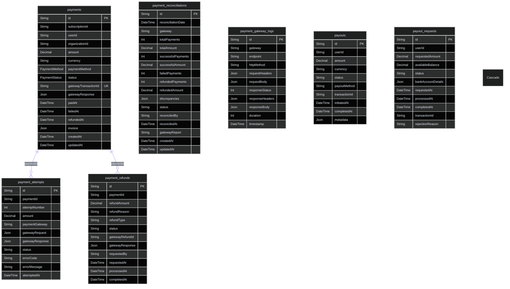
```mermaid
%%{init: {"theme":"dark","themeVariables":{"fontFamily":"Inter, Segoe UI, Arial, sans-serif","background":"#0f172a","primaryColor":"#1e293b","secondaryColor":"#111827","tertiaryColor":"#0b1020","primaryBorderColor":"#8b5cf6","secondaryBorderColor":"#38bdf8","tertiaryBorderColor":"#14b8a6","lineColor":"#8b5cf6","textColor":"#e2e8f0","fontSize":"16px"}}}%%
erDiagram
  %% Source: dbml-modules/17-payments-billing.dbml
  %% Tables: 7
  %% Internal relationships: 2
  %% Table: payments
  payments {
    String id PK
    String subscriptionId
    String userId
    String organizationId
    Decimal amount
    String currency
    PaymentMethod paymentMethod
    PaymentStatus status
    String gatewayTransactionId UK
    Json gatewayResponse
    DateTime paidAt
    DateTime failedAt
    DateTime refundedAt
    Json invoice
    DateTime createdAt
    DateTime updatedAt
  }
  %% Table: payment_attempts
  payment_attempts {
    String id PK
    String paymentId
    Int attemptNumber
    Decimal amount
    String paymentGateway
    Json gatewayRequest
    Json gatewayResponse
    String status
    String errorCode
    String errorMessage
    DateTime attemptedAt
  }
  %% Table: payment_refunds
  payment_refunds {
    String id PK
    String paymentId
    Decimal refundAmount
    String refundReason
    String refundType
    String status
    String gatewayRefundId
    Json gatewayResponse
    String requestedBy
    DateTime requestedAt
    DateTime processedAt
    DateTime completedAt
  }
  %% Table: payment_reconciliations
  payment_reconciliations {
    String id PK
    DateTime reconciliationDate
    String gateway
    Int totalPayments
    Decimal totalAmount
    Int successfulPayments
    Decimal successfulAmount
    Int failedPayments
    Int refundedPayments
    Decimal refundedAmount
    Json discrepancies
    String status
    String reconciledBy
    DateTime reconciledAt
    String gatewayReport
    DateTime createdAt
    DateTime updatedAt
  }
  %% Table: payment_gateway_logs
  payment_gateway_logs {
    String id PK
    String gateway
    String endpoint
    String httpMethod
    Json requestHeaders
    Json requestBody
    Int responseStatus
    Json responseHeaders
    Json responseBody
    Int duration
    DateTime timestamp
  }
  %% Table: payouts
  payouts {
    String id PK
    String userId
    Decimal amount
    String currency
    String status
    String payoutMethod
    String transactionId
    DateTime initiatedAt
    DateTime completedAt
    Json metadata
  }
  %% Table: payout_requests
  payout_requests {
    String id PK
    String userId
    Decimal requestedAmount
    Decimal availableBalance
    String status
    Json bankAccountDetails
    DateTime requestedAt
    DateTime processedAt
    DateTime completedAt
    String transactionId
    String rejectionReason
  }

  %% Relationships
  payments ||--o{ payment_attempts : paymentId Cascade
  payments ||--o{ payment_refunds : paymentId Cascade

```

## 18-subscriptions.dbml

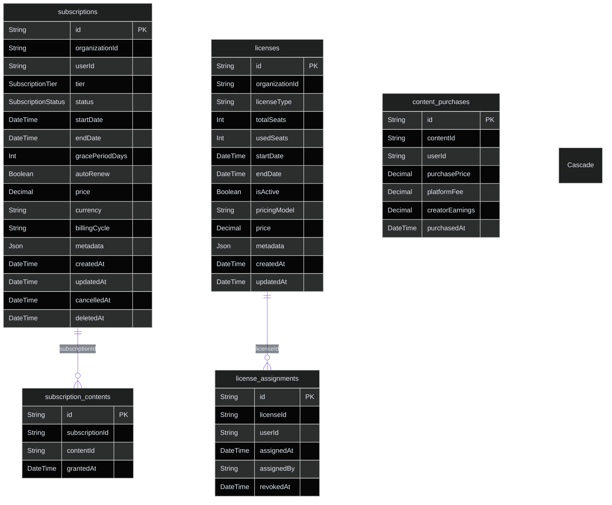
```mermaid
%%{init: {"theme":"dark","themeVariables":{"fontFamily":"Inter, Segoe UI, Arial, sans-serif","background":"#0f172a","primaryColor":"#1e293b","secondaryColor":"#111827","tertiaryColor":"#0b1020","primaryBorderColor":"#8b5cf6","secondaryBorderColor":"#38bdf8","tertiaryBorderColor":"#14b8a6","lineColor":"#8b5cf6","textColor":"#e2e8f0","fontSize":"16px"}}}%%
erDiagram
  %% Source: dbml-modules/18-subscriptions.dbml
  %% Tables: 5
  %% Internal relationships: 2
  %% Table: subscriptions
  subscriptions {
    String id PK
    String organizationId
    String userId
    SubscriptionTier tier
    SubscriptionStatus status
    DateTime startDate
    DateTime endDate
    Int gracePeriodDays
    Boolean autoRenew
    Decimal price
    String currency
    String billingCycle
    Json metadata
    DateTime createdAt
    DateTime updatedAt
    DateTime cancelledAt
    DateTime deletedAt
  }
  %% Table: subscription_contents
  subscription_contents {
    String id PK
    String subscriptionId
    String contentId
    DateTime grantedAt
  }
  %% Table: licenses
  licenses {
    String id PK
    String organizationId
    String licenseType
    Int totalSeats
    Int usedSeats
    DateTime startDate
    DateTime endDate
    Boolean isActive
    String pricingModel
    Decimal price
    Json metadata
    DateTime createdAt
    DateTime updatedAt
  }
  %% Table: license_assignments
  license_assignments {
    String id PK
    String licenseId
    String userId
    DateTime assignedAt
    String assignedBy
    DateTime revokedAt
  }
  %% Table: content_purchases
  content_purchases {
    String id PK
    String contentId
    String userId
    Decimal purchasePrice
    Decimal platformFee
    Decimal creatorEarnings
    DateTime purchasedAt
  }

  %% Relationships
  licenses ||--o{ license_assignments : licenseId Cascade
  subscriptions ||--o{ subscription_contents : subscriptionId Cascade

```

## 19-erp-hostel-library.dbml

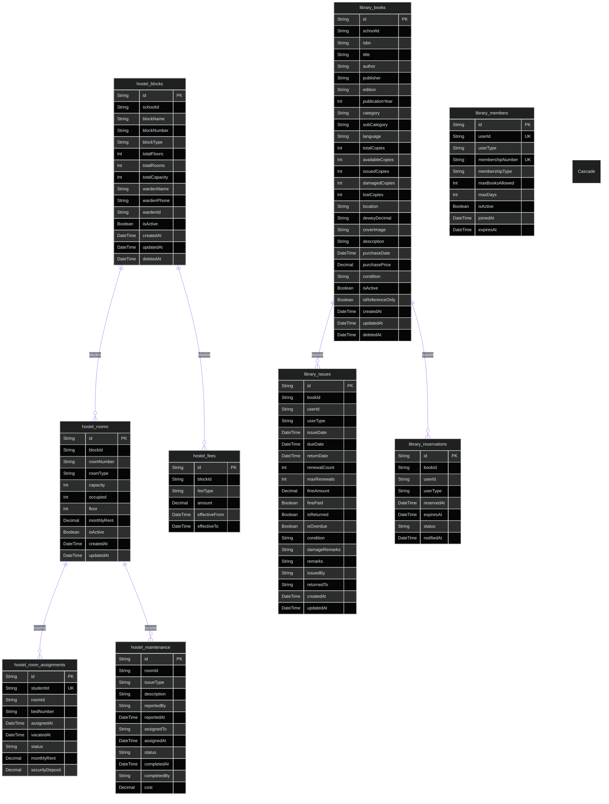
```mermaid
%%{init: {"theme":"dark","themeVariables":{"fontFamily":"Inter, Segoe UI, Arial, sans-serif","background":"#0f172a","primaryColor":"#1e293b","secondaryColor":"#111827","tertiaryColor":"#0b1020","primaryBorderColor":"#8b5cf6","secondaryBorderColor":"#38bdf8","tertiaryBorderColor":"#14b8a6","lineColor":"#8b5cf6","textColor":"#e2e8f0","fontSize":"16px"}}}%%
erDiagram
  %% Source: dbml-modules/19-erp-hostel-library.dbml
  %% Tables: 9
  %% Internal relationships: 6
  %% Table: hostel_blocks
  hostel_blocks {
    String id PK
    String schoolId
    String blockName
    String blockNumber
    String blockType
    Int totalFloors
    Int totalRooms
    Int totalCapacity
    String wardenName
    String wardenPhone
    String wardenId
    Boolean isActive
    DateTime createdAt
    DateTime updatedAt
    DateTime deletedAt
  }
  %% Table: hostel_rooms
  hostel_rooms {
    String id PK
    String blockId
    String roomNumber
    String roomType
    Int capacity
    Int occupied
    Int floor
    Decimal monthlyRent
    Boolean isActive
    DateTime createdAt
    DateTime updatedAt
  }
  %% Table: hostel_room_assignments
  hostel_room_assignments {
    String id PK
    String studentId UK
    String roomId
    String bedNumber
    DateTime assignedAt
    DateTime vacatedAt
    String status
    Decimal monthlyRent
    Decimal securityDeposit
  }
  %% Table: hostel_fees
  hostel_fees {
    String id PK
    String blockId
    String feeType
    Decimal amount
    DateTime effectiveFrom
    DateTime effectiveTo
  }
  %% Table: hostel_maintenance
  hostel_maintenance {
    String id PK
    String roomId
    String issueType
    String description
    String reportedBy
    DateTime reportedAt
    String assignedTo
    DateTime assignedAt
    String status
    DateTime completedAt
    String completedBy
    Decimal cost
  }
  %% Table: library_books
  library_books {
    String id PK
    String schoolId
    String isbn
    String title
    String author
    String publisher
    String edition
    Int publicationYear
    String category
    String subCategory
    String language
    Int totalCopies
    Int availableCopies
    Int issuedCopies
    Int damagedCopies
    Int lostCopies
    String location
    String deweyDecimal
    String coverImage
    String description
    DateTime purchaseDate
    Decimal purchasePrice
    String condition
    Boolean isActive
    Boolean isReferenceOnly
    DateTime createdAt
    DateTime updatedAt
    DateTime deletedAt
  }
  %% Table: library_issues
  library_issues {
    String id PK
    String bookId
    String userId
    String userType
    DateTime issueDate
    DateTime dueDate
    DateTime returnDate
    Int renewalCount
    Int maxRenewals
    Decimal fineAmount
    Boolean finePaid
    Boolean isReturned
    Boolean isOverdue
    String condition
    String damageRemarks
    String remarks
    String issuedBy
    String returnedTo
    DateTime createdAt
    DateTime updatedAt
  }
  %% Table: library_reservations
  library_reservations {
    String id PK
    String bookId
    String userId
    String userType
    DateTime reservedAt
    DateTime expiresAt
    String status
    DateTime notifiedAt
  }
  %% Table: library_members
  library_members {
    String id PK
    String userId UK
    String userType
    String membershipNumber UK
    String membershipType
    Int maxBooksAllowed
    Int maxDays
    Boolean isActive
    DateTime joinedAt
    DateTime expiresAt
  }

  %% Relationships
  library_books ||--o{ library_issues : bookId Cascade
  library_books ||--o{ library_reservations : bookId Cascade
  hostel_blocks ||--o{ hostel_rooms : blockId Cascade
  hostel_rooms ||--o{ hostel_room_assignments : roomId Cascade
  hostel_blocks ||--o{ hostel_fees : blockId Cascade
  hostel_rooms ||--o{ hostel_maintenance : roomId Cascade

```

## 20-erp-transport-inventory.dbml

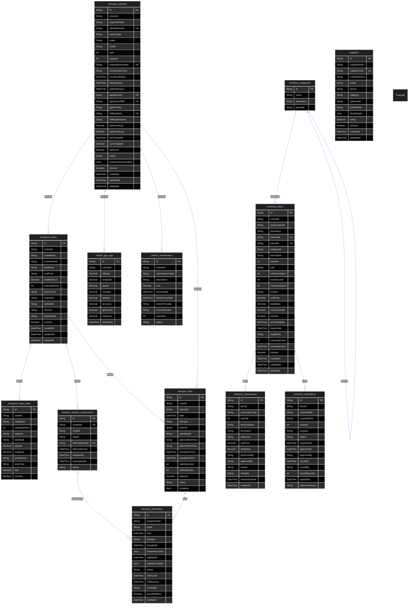
```mermaid
%%{init: {"theme":"dark","themeVariables":{"fontFamily":"Inter, Segoe UI, Arial, sans-serif","background":"#0f172a","primaryColor":"#1e293b","secondaryColor":"#111827","tertiaryColor":"#0b1020","primaryBorderColor":"#8b5cf6","secondaryBorderColor":"#38bdf8","tertiaryBorderColor":"#14b8a6","lineColor":"#8b5cf6","textColor":"#e2e8f0","fontSize":"16px"}}}%%
erDiagram
  %% Source: dbml-modules/20-erp-transport-inventory.dbml
  %% Tables: 13
  %% Internal relationships: 13
  %% Table: transport_routes
  transport_routes {
    String id PK
    String schoolId
    String routeName
    String routeNumber
    String startPoint
    String endPoint
    Decimal totalDistance
    Int estimatedTime
    String pickupTime
    String dropTime
    String vehicleId
    String driverId
    String attendantId
    Boolean isActive
    DateTime createdAt
    DateTime updatedAt
    DateTime deletedAt
  }
  %% Table: transport_route_stops
  transport_route_stops {
    String id PK
    String routeId
    String stopName
    Int stopSequence
    String address
    String landmark
    Decimal latitude
    Decimal longitude
    String pickupTime
    String dropTime
    Decimal fare
    Boolean isActive
  }
  %% Table: transport_vehicles
  transport_vehicles {
    String id PK
    String schoolId
    String organizationId
    String vehicleNumber UK
    String vehicleType
    String make
    String model
    Int year
    Int capacity
    String registrationNumber UK
    String insuranceNumber
    DateTime insuranceExpiry
    DateTime fitnessExpiry
    DateTime pollutionExpiry
    String gpsDeviceId UK
    String gpsDeviceIMEI UK
    String gpsProvider
    String rfidReaderId UK
    String rfidReaderSerial
    Decimal lastKnownLat
    Decimal lastKnownLng
    DateTime lastTrackedAt
    Decimal currentSpeed
    Decimal fuelLevel
    String status
    Json maintenanceSchedule
    Boolean isActive
    DateTime createdAt
    DateTime updatedAt
    DateTime deletedAt
  }
  %% Table: vehicle_gps_logs
  vehicle_gps_logs {
    String id PK
    String vehicleId
    Decimal latitude
    Decimal longitude
    Decimal speed
    Decimal heading
    Decimal altitude
    Decimal accuracy
    Boolean ignitionOn
    Decimal fuelLevel
    DateTime timestamp
  }
  %% Table: vehicle_maintenance
  vehicle_maintenance {
    String id PK
    String vehicleId
    String maintenanceType
    String description
    Decimal cost
    DateTime serviceDate
    DateTime nextServiceDate
    String serviceProvider
    String invoiceNumber
    Int odometer
    String status
  }
  %% Table: transport_trips
  transport_trips {
    String id PK
    String routeId
    String vehicleId
    DateTime date
    String tripType
    String driverId
    String attendantId
    String plannedStartTime
    String plannedEndTime
    DateTime actualStartTime
    DateTime actualEndTime
    Int startOdometer
    Int endOdometer
    Decimal distance
    String status
    Json incidents
  }
  %% Table: transport_attendance
  transport_attendance {
    String id PK
    String assignmentId
    String tripId
    DateTime date
    String tripType
    DateTime boardedAt
    Json boardedLocation
    DateTime alightedAt
    Json alightedLocation
    String status
    DateTime rfidScanIn
    DateTime rfidScanOut
    String verifiedBy
    Boolean parentNotified
    DateTime notifiedAt
  }
  %% Table: transport_student_assignments
  transport_student_assignments {
    String id PK
    String studentId UK
    String routeId
    String stopId
    String rfidCardNumber UK
    DateTime rfidCardIssued
    DateTime assignedAt
    DateTime unassignedAt
    String status
  }
  %% Table: inventory_categories
  inventory_categories {
    String id PK
    String name
    String description
    String parentId
  }
  %% Table: inventory_items
  inventory_items {
    String id PK
    String schoolId
    String organizationId
    String itemName
    String itemCode UK
    String barcode UK
    String categoryId
    String description
    Int quantity
    String unit
    Int minimumStock
    Int reorderLevel
    Int maximumStock
    String location
    Decimal unitPrice
    Decimal totalValue
    Boolean isConsumable
    Boolean isAsset
    DateTime purchaseDate
    DateTime expiryDate
    String supplierId
    Int warrantyPeriod
    DateTime warrantyExpiry
    Boolean isActive
    DateTime createdAt
    DateTime updatedAt
    DateTime deletedAt
  }
  %% Table: inventory_transactions
  inventory_transactions {
    String id PK
    String itemId
    String transactionType
    Int quantity
    String fromLocation
    String toLocation
    String reference
    Decimal unitPrice
    Decimal totalValue
    String performedBy
    String approvedBy
    String reason
    String remarks
    DateTime transactionDate
    DateTime createdAt
  }
  %% Table: inventory_requisitions
  inventory_requisitions {
    String id PK
    String itemId
    String requestedBy
    String requestedFor
    Int quantity
    String purpose
    String status
    DateTime requestedAt
    DateTime approvedAt
    String approvedBy
    DateTime issuedAt
    String issuedBy
    Int issuedQuantity
    DateTime rejectedAt
    String rejectionReason
  }
  %% Table: suppliers
  suppliers {
    String id PK
    String supplierName
    String supplierCode UK
    String contactPerson
    String email
    String phone
    String category
    String gstNumber
    String panNumber
    Json bankDetails
    Decimal rating
    Boolean isActive
    DateTime createdAt
    DateTime updatedAt
  }

  %% Relationships
  inventory_categories ||--|| inventory_categories : parentId
  inventory_categories ||--o{ inventory_items : categoryId
  inventory_items ||--o{ inventory_transactions : itemId Cascade
  inventory_items ||--o{ inventory_requisitions : itemId Cascade
  transport_vehicles ||--o{ transport_routes : vehicleId
  transport_routes ||--o{ transport_route_stops : routeId Cascade
  transport_vehicles ||--o{ vehicle_gps_logs : vehicleId Cascade
  transport_vehicles ||--o{ vehicle_maintenance : vehicleId Cascade
  transport_routes ||--o{ transport_student_assignments : routeId Cascade
  transport_student_assignments ||--o{ transport_attendance : assignmentId Cascade
  transport_trips ||--o{ transport_attendance : tripId
  transport_routes ||--o{ transport_trips : routeId Cascade
  transport_vehicles ||--o{ transport_trips : vehicleId Cascade

```

## 21-erp-payroll-hr.dbml

```mermaid
%%{init: {"theme":"dark","themeVariables":{"fontFamily":"Inter, Segoe UI, Arial, sans-serif","background":"#0f172a","primaryColor":"#1e293b","secondaryColor":"#111827","tertiaryColor":"#0b1020","primaryBorderColor":"#8b5cf6","secondaryBorderColor":"#38bdf8","tertiaryBorderColor":"#14b8a6","lineColor":"#8b5cf6","textColor":"#e2e8f0","fontSize":"16px"}}}%%
erDiagram
  %% Source: dbml-modules/21-erp-payroll-hr.dbml
  %% Tables: 4
  %% Internal relationships: 0
  %% Table: payroll_structures
  payroll_structures {
    String id PK
    String schoolId
    String organizationId
    String structureName
    String designation
    Decimal basicSalary
    Json allowances
    Json deductions
    Decimal grossSalary
    Decimal netSalary
    DateTime effectiveFrom
    DateTime effectiveTo
    Boolean isActive
    DateTime createdAt
    DateTime updatedAt
  }
  %% Table: employee_salaries
  employee_salaries {
    String id PK
    String employeeId
    String employeeType
    String payrollStructureId
    String monthYear
    Int workingDays
    Int presentDays
    Decimal basicSalary
    Json allowances
    Json bonuses
    Json deductions
    Json penalties
    Decimal grossSalary
    Decimal netSalary
    String status
    String approvedBy
    DateTime approvedAt
    DateTime paidOn
    String paymentMethod
    String transactionId
    DateTime createdAt
    DateTime updatedAt
  }
  %% Table: payroll_advances
  payroll_advances {
    String id PK
    String employeeId
    Decimal advanceAmount
    String reason
    DateTime requestedAt
    DateTime approvedAt
    String approvedBy
    String status
    DateTime disbursedAt
    Decimal disbursedAmount
    String repaymentMode
    Int installments
    Decimal installmentAmount
    Decimal balanceAmount
  }
  %% Table: leave_balances
  leave_balances {
    String id PK
    String employeeId
    String employeeType
    String leaveType
    Int totalLeaves
    Int usedLeaves
    Int balanceLeaves
    Int year
  }

  %% No internal relationships in this module

```

## 22-marketplace.dbml

```mermaid
%%{init: {"theme":"dark","themeVariables":{"fontFamily":"Inter, Segoe UI, Arial, sans-serif","background":"#0f172a","primaryColor":"#1e293b","secondaryColor":"#111827","tertiaryColor":"#0b1020","primaryBorderColor":"#8b5cf6","secondaryBorderColor":"#38bdf8","tertiaryBorderColor":"#14b8a6","lineColor":"#8b5cf6","textColor":"#e2e8f0","fontSize":"16px"}}}%%
erDiagram
  %% Source: dbml-modules/22-marketplace.dbml
  %% Tables: 5
  %% Internal relationships: 1
  %% Table: marketplace_products
  marketplace_products {
    String id PK
    String contentId
    String publisherId
    String creatorId
    String productName
    String description
    String productType
    Decimal price
    String currency
    Decimal discountPercent
    Decimal discountedPrice
    Boolean isActive
    Boolean isFeatured
    Int salesCount
    Decimal revenueGenerated
    Decimal rating
    Int reviewCount
    DateTime createdAt
    DateTime updatedAt
  }
  %% Table: marketplace_orders
  marketplace_orders {
    String id PK
    String productId
    String buyerId
    Int quantity
    Decimal totalAmount
    Decimal platformFee
    Decimal sellerEarnings
    String status
    String paymentId
    DateTime orderedAt
    DateTime completedAt
  }
  %% Table: content_recommendations
  content_recommendations {
    String id PK
    String userId
    String contentId
    String recommendationType
    Decimal score
    Boolean viewed
    Boolean clicked
    DateTime createdAt
  }
  %% Table: creator_monetization_plans
  creator_monetization_plans {
    String id PK
    String creatorId
    String planType
    Int maxUploads
    Int maxStorage
    Decimal platformCommissionPercent
    Boolean isActive
    DateTime startDate
    DateTime endDate
    DateTime createdAt
    DateTime updatedAt
  }
  %% Table: publisher_monetization_plans
  publisher_monetization_plans {
    String id PK
    String publisherId
    String planType
    Int maxUploads
    Int maxStorage
    Decimal platformCommissionPercent
    Boolean isActive
    DateTime startDate
    DateTime endDate
    DateTime createdAt
    DateTime updatedAt
  }

  %% Relationships
  marketplace_products ||--o{ marketplace_orders : productId Cascade

```

## 23-ai-chatbot.dbml

```mermaid
%%{init: {"theme":"dark","themeVariables":{"fontFamily":"Inter, Segoe UI, Arial, sans-serif","background":"#0f172a","primaryColor":"#1e293b","secondaryColor":"#111827","tertiaryColor":"#0b1020","primaryBorderColor":"#8b5cf6","secondaryBorderColor":"#38bdf8","tertiaryBorderColor":"#14b8a6","lineColor":"#8b5cf6","textColor":"#e2e8f0","fontSize":"16px"}}}%%
erDiagram
  %% Source: dbml-modules/23-ai-chatbot.dbml
  %% Tables: 8
  %% Internal relationships: 0
  %% Table: chatbot_conversations
  chatbot_conversations {
    String id PK
    String userId
    String sessionId
    Json conversationData
    DateTime startedAt
    DateTime endedAt
    Int totalMessages
    Int satisfaction
    String feedback
  }
  %% Table: chatbot_messages
  chatbot_messages {
    String id PK
    String conversationId
    String role
    String content
    String intent
    Json entities
    Decimal confidence
    Boolean isHelpful
    String feedback
    DateTime timestamp
  }
  %% Table: ai_prompts
  ai_prompts {
    String id PK
    String userId
    String promptText
    String promptType
    Json context
    String responseText
    Int responseTime
    String modelUsed
    Int tokensUsed
    Boolean wasSuccessful
    DateTime createdAt
  }
  %% Table: ai_feedback
  ai_feedback {
    String id PK
    String entityType
    String entityId
    String userId
    Int rating
    Boolean isHelpful
    String feedbackText
    DateTime createdAt
  }
  %% Table: token_usage
  token_usage {
    String id PK
    String userId
    String organizationId
    String modelProvider
    String modelName
    String modelVersion
    Int promptTokens
    Int completionTokens
    Int totalTokens
    Decimal cost
    String requestType
    String entityType
    String entityId
    Int responseTime
    DateTime createdAt
  }
  %% Table: model_providers
  model_providers {
    String id PK
    String name UK
    String displayName
    String apiEndpoint
    Json availableModels
    Boolean isActive
    Json rateLimits
    DateTime createdAt
    DateTime updatedAt
  }
  %% Table: prompt_templates
  prompt_templates {
    String id PK
    String name UK
    String description
    String templateText
    String category
    String modelProvider
    String modelName
    Decimal temperature
    Int maxTokens
    Int version
    Boolean isActive
    Int usageCount
    String createdBy
    DateTime createdAt
    DateTime updatedAt
  }
  %% Table: inference_logs
  inference_logs {
    String id PK
    String modelProvider
    String modelName
    String inputText
    String outputText
    Int promptTokens
    Int completionTokens
    Int responseTime
    Boolean success
    String errorMessage
    String userId
    String organizationId
    Json metadata
    DateTime createdAt
  }

  %% No internal relationships in this module

```

## 24-ai-recommendations.dbml

```mermaid
%%{init: {"theme":"dark","themeVariables":{"fontFamily":"Inter, Segoe UI, Arial, sans-serif","background":"#0f172a","primaryColor":"#1e293b","secondaryColor":"#111827","tertiaryColor":"#0b1020","primaryBorderColor":"#8b5cf6","secondaryBorderColor":"#38bdf8","tertiaryBorderColor":"#14b8a6","lineColor":"#8b5cf6","textColor":"#e2e8f0","fontSize":"16px"}}}%%
erDiagram
  %% Source: dbml-modules/24-ai-recommendations.dbml
  %% Tables: 3
  %% Internal relationships: 0
  %% Table: ai_recommendations
  ai_recommendations {
    String id PK
    String userId
    String recommendationType
    Json recommendations
    String modelVersion
    Decimal confidence
    Json reasons
    Boolean isAccepted
    DateTime acceptedAt
    DateTime generatedAt
    DateTime expiresAt
  }
  %% Table: ai_predictions
  ai_predictions {
    String id PK
    String studentId
    String predictionType
    String subjectId
    String examId
    Json predictedValue
    Decimal confidence
    Json actualValue
    Json features
    String modelVersion
    DateTime predictedAt
  }
  %% Table: student_learning_styles
  student_learning_styles {
    String id PK
    String studentId UK
    Decimal visualScore
    Decimal auditoryScore
    Decimal kinestheticScore
    Decimal readingWritingScore
    String optimalStudyTime
    Int attentionSpan
    DateTime analysisDate
    DateTime lastUpdated
  }

  %% No internal relationships in this module

```

## 25-ai-embeddings.dbml

```mermaid
%%{init: {"theme":"dark","themeVariables":{"fontFamily":"Inter, Segoe UI, Arial, sans-serif","background":"#0f172a","primaryColor":"#1e293b","secondaryColor":"#111827","tertiaryColor":"#0b1020","primaryBorderColor":"#8b5cf6","secondaryBorderColor":"#38bdf8","tertiaryBorderColor":"#14b8a6","lineColor":"#8b5cf6","textColor":"#e2e8f0","fontSize":"16px"}}}%%
erDiagram
  %% Source: dbml-modules/25-ai-embeddings.dbml
  %% Tables: 5
  %% Internal relationships: 1
  %% Table: content_embeddings
  content_embeddings {
    String id PK
    String contentId UK
    String embeddingModel
    String embedding
    Json metadata
    DateTime createdAt
    DateTime updatedAt
  }
  %% Table: vector_embeddings
  vector_embeddings {
    String id PK
    String indexId
    String entityType
    String entityId
    String embedding
    Json metadata
    DateTime createdAt
    DateTime updatedAt
  }
  %% Table: vector_indexes
  vector_indexes {
    String id PK
    String indexName UK
    String indexType
    Int dimension
    Int totalVectors
    Boolean isActive
    DateTime createdAt
    DateTime updatedAt
  }
  %% Table: document_chunks
  document_chunks {
    String id PK
    String documentId
    String documentType
    Int chunkIndex
    String chunkText
    String embeddingId
    Json metadata
    DateTime createdAt
  }
  %% Table: retrieval_queries
  retrieval_queries {
    String id PK
    String userId
    String query
    Json retrievedChunks
    Boolean wasHelpful
    DateTime createdAt
  }

  %% Relationships
  vector_indexes ||--o{ vector_embeddings : indexId Cascade

```

## 26-notifications.dbml

```mermaid
%%{init: {"theme":"dark","themeVariables":{"fontFamily":"Inter, Segoe UI, Arial, sans-serif","background":"#0f172a","primaryColor":"#1e293b","secondaryColor":"#111827","tertiaryColor":"#0b1020","primaryBorderColor":"#8b5cf6","secondaryBorderColor":"#38bdf8","tertiaryBorderColor":"#14b8a6","lineColor":"#8b5cf6","textColor":"#e2e8f0","fontSize":"16px"}}}%%
erDiagram
  %% Source: dbml-modules/26-notifications.dbml
  %% Tables: 6
  %% Internal relationships: 1
  %% Table: notifications
  notifications {
    String id PK
    String userId
    String title
    String message
    String type
    NotificationPriority priority
    String resourceType
    String resourceId
    Boolean isRead
    DateTime readAt
    DateTime scheduledAt
    DateTime sentAt
    String templateId
    Json templateData
    Json metadata
    DateTime createdAt
    DateTime deletedAt
  }
  %% Table: notification_templates
  notification_templates {
    String id PK
    String name
    String templateType
    String subject
    String body
    Boolean isActive
    DateTime createdAt
    DateTime updatedAt
  }
  %% Table: notification_preferences
  notification_preferences {
    String id PK
    String userId UK
    Boolean emailEnabled
    Boolean smsEnabled
    Boolean pushEnabled
    Boolean whatsappEnabled
    Json preferences
    DateTime updatedAt
  }
  %% Table: notification_deliveries
  notification_deliveries {
    String id PK
    String notificationId
    String channel
    String recipient
    String status
    Int attempts
    DateTime sentAt
    DateTime deliveredAt
    DateTime openedAt
    DateTime clickedAt
    String error
    String gatewayId
    Json gatewayResponse
  }
  %% Table: sms_logs
  sms_logs {
    String id PK
    String userId
    String phone
    String message
    String status
    String gateway
    String gatewayId
    DateTime sentAt
    DateTime deliveredAt
    Decimal cost
  }
  %% Table: email_logs
  email_logs {
    String id PK
    String userId
    String email
    String subject
    String body
    String status
    String provider
    String providerId
    DateTime sentAt
    DateTime deliveredAt
    DateTime openedAt
  }

  %% Relationships
  notifications ||--o{ notification_deliveries : notificationId Cascade

```

## 27-messaging-chat.dbml

```mermaid
%%{init: {"theme":"dark","themeVariables":{"fontFamily":"Inter, Segoe UI, Arial, sans-serif","background":"#0f172a","primaryColor":"#1e293b","secondaryColor":"#111827","tertiaryColor":"#0b1020","primaryBorderColor":"#8b5cf6","secondaryBorderColor":"#38bdf8","tertiaryBorderColor":"#14b8a6","lineColor":"#8b5cf6","textColor":"#e2e8f0","fontSize":"16px"}}}%%
erDiagram
  %% Source: dbml-modules/27-messaging-chat.dbml
  %% Tables: 9
  %% Internal relationships: 6
  %% Table: conversations
  conversations {
    String id PK
    String conversationType
    String name
    String description
    String avatarUrl
    String createdBy
    DateTime createdAt
    DateTime updatedAt
    DateTime lastMessageAt
    String lastMessagePreview
    Boolean isArchived
    Json metadata
  }
  %% Table: messages
  messages {
    String id PK
    String conversationId
    String senderId
    String recipientId
    String groupId
    String subject
    String body
    String messageType
    String replyToId
    Boolean isEdited
    DateTime editedAt
    Boolean isDeleted
    DateTime deletedAt
    DateTime sentAt
    Json metadata
  }
  %% Table: message_participants
  message_participants {
    String id PK
    String conversationId
    String userId
    String role
    DateTime joinedAt
    DateTime leftAt
    DateTime lastReadAt
    Boolean isMuted
    Boolean isPinned
  }
  %% Table: message_attachments
  message_attachments {
    String id PK
    String messageId
    String fileName
    String fileUrl
    String fileType
    Int fileSize
    String thumbnailUrl
    DateTime uploadedAt
  }
  %% Table: message_read_receipts
  message_read_receipts {
    String id PK
    String messageId
    String userId
    DateTime readAt
  }
  %% Table: message_reactions
  message_reactions {
    String id PK
    String messageId
    String userId
    String emoji
    DateTime createdAt
  }
  %% Table: pinned_messages
  pinned_messages {
    String id PK
    String conversationId
    String messageId
    String pinnedBy
    DateTime pinnedAt
  }
  %% Table: message_groups
  message_groups {
    String id PK
    String name
    String description
    String createdBy
    DateTime createdAt
    DateTime updatedAt
  }
  %% Table: announcements
  announcements {
    String id PK
    String schoolId
    String organizationId
    String title
    String content
    DateTime publishedAt
    DateTime expiresAt
    Boolean isPinned
    String createdBy
    DateTime createdAt
    DateTime updatedAt
  }

  %% Relationships
  conversations ||--o{ message_participants : conversationId Cascade
  conversations ||--o{ messages : conversationId Cascade
  messages ||--|| messages : replyToId
  messages ||--o{ message_attachments : messageId Cascade
  messages ||--o{ message_read_receipts : messageId Cascade
  messages ||--o{ message_reactions : messageId Cascade

```

## 28-analytics-reporting.dbml

```mermaid
%%{init: {"theme":"dark","themeVariables":{"fontFamily":"Inter, Segoe UI, Arial, sans-serif","background":"#0f172a","primaryColor":"#1e293b","secondaryColor":"#111827","tertiaryColor":"#0b1020","primaryBorderColor":"#8b5cf6","secondaryBorderColor":"#38bdf8","tertiaryBorderColor":"#14b8a6","lineColor":"#8b5cf6","textColor":"#e2e8f0","fontSize":"16px"}}}%%
erDiagram
  %% Source: dbml-modules/28-analytics-reporting.dbml
  %% Tables: 8
  %% Internal relationships: 1
  %% Table: analytics_snapshots
  analytics_snapshots {
    String id PK
    String snapshotType
    DateTime snapshotDate
    String entityType
    String entityId
    Json metrics
    DateTime createdAt
  }
  %% Table: metric_definitions
  metric_definitions {
    String id PK
    String metricKey UK
    String metricName
    String description
    String category
    String calculationFormula
    String unit
    Boolean isActive
    DateTime createdAt
    DateTime updatedAt
  }
  %% Table: kpis
  kpis {
    String id PK
    String metricId
    String name
    Decimal targetValue
    Decimal currentValue
    Json threshold
    String entityType
    String entityId
    String period
    DateTime periodDate
    String status
  }
  %% Table: dashboard_cache
  dashboard_cache {
    String id PK
    String dashboardKey UK
    String userId
    String organizationId
    Json cacheData
    DateTime expiresAt
    DateTime createdAt
  }
  %% Table: analytics_reports
  analytics_reports {
    String id PK
    String organizationId
    String schoolId
    String reportType
    String reportName
    Json filters
    Json data
    String generatedBy
    DateTime generatedAt
    String format
    String fileUrl
    Boolean isScheduled
    Json schedule
  }
  %% Table: school_analytics
  school_analytics {
    String id PK
    String schoolId
    String academicYearId
    Int totalStudents
    Int totalTeachers
    Decimal averageAttendance
    Decimal passPercentage
    Decimal averageGPA
    Decimal revenueCollected
    Decimal outstandingFees
    Decimal infraUtilization
    Decimal studentTeacherRatio
    DateTime calculatedAt
  }
  %% Table: student_analytics
  student_analytics {
    String id PK
    String studentId UK
    Decimal overallGPA
    Decimal overallPercentage
    Decimal attendancePercent
    String learningStyle
    Decimal engagementScore
    Json predictedPerformance
    Json recommendations
    DateTime calculatedAt
  }
  %% Table: teacher_analytics
  teacher_analytics {
    String id PK
    String teacherId UK
    Decimal averageStudentScore
    Decimal classCompletionRate
    Decimal syllabusCompletionRate
    Decimal attendancePercent
    Decimal studentSatisfaction
    Int assignmentsCreated
    Int examsCreated
    Decimal gradingTurnaround
    Int professionalDevelopmentHours
    DateTime calculatedAt
  }

  %% Relationships
  metric_definitions ||--o{ kpis : metricId

```

## 29-search-discovery.dbml

```mermaid
%%{init: {"theme":"dark","themeVariables":{"fontFamily":"Inter, Segoe UI, Arial, sans-serif","background":"#0f172a","primaryColor":"#1e293b","secondaryColor":"#111827","tertiaryColor":"#0b1020","primaryBorderColor":"#8b5cf6","secondaryBorderColor":"#38bdf8","tertiaryBorderColor":"#14b8a6","lineColor":"#8b5cf6","textColor":"#e2e8f0","fontSize":"16px"}}}%%
erDiagram
  %% Source: dbml-modules/29-search-discovery.dbml
  %% Tables: 8
  %% Internal relationships: 0
  %% Table: search_indexes
  search_indexes {
    String id PK
    String entityType
    String entityId
    String searchableText
    String title
    String description
    Json metadata
    Int popularity
    DateTime lastAccessedAt
    Boolean isActive
    DateTime createdAt
    DateTime updatedAt
  }
  %% Table: search_keywords
  search_keywords {
    String id PK
    String keyword UK
    Int searchCount
    DateTime lastSearchedAt
  }
  %% Table: search_analytics
  search_analytics {
    String id PK
    String userId
    String query
    Int resultsCount
    Json clickedResults
    Int refinements
    Int timeSpent
    Boolean wasSuccessful
    DateTime createdAt
  }
  %% Table: recent_searches
  recent_searches {
    String id PK
    String userId
    String query
    String entityType
    DateTime searchedAt
  }
  %% Table: search_facets
  search_facets {
    String id PK
    String facetType
    String facetKey
    String facetValue
    String displayName
    Int count
    Int sortOrder
    Boolean isActive
  }
  %% Table: synonyms
  synonyms {
    String id PK
    String term UK
    String category
    Boolean isActive
    String createdBy
    DateTime createdAt
    DateTime updatedAt
  }
  %% Table: search_suggestions
  search_suggestions {
    String id PK
    String query UK
    String suggestion
    Int searchCount
    Int clickCount
    Decimal relevanceScore
    Boolean isActive
    DateTime lastSearchedAt
    DateTime createdAt
    DateTime updatedAt
  }
  %% Table: search_queries
  search_queries {
    String id PK
    String userId
    String query
    Json filters
    Int resultsCount
    String clickedResultId
    Int clickPosition
    DateTime timestamp
  }

  %% No internal relationships in this module

```

## 30-certificates-ids.dbml

```mermaid
%%{init: {"theme":"dark","themeVariables":{"fontFamily":"Inter, Segoe UI, Arial, sans-serif","background":"#0f172a","primaryColor":"#1e293b","secondaryColor":"#111827","tertiaryColor":"#0b1020","primaryBorderColor":"#8b5cf6","secondaryBorderColor":"#38bdf8","tertiaryBorderColor":"#14b8a6","lineColor":"#8b5cf6","textColor":"#e2e8f0","fontSize":"16px"}}}%%
erDiagram
  %% Source: dbml-modules/30-certificates-ids.dbml
  %% Tables: 4
  %% Internal relationships: 2
  %% Table: certificates
  certificates {
    String id PK
    String templateId
    String recipientId
    String recipientType
    String certificateNumber UK
    String title
    String description
    String issuedFor
    Json data
    String generatedPdfUrl
    String issuedBy
    DateTime issuedAt
    DateTime expiresAt
    Boolean isRevoked
    DateTime revokedAt
    String revokedReason
    String verificationCode UK
  }
  %% Table: certificate_templates
  certificate_templates {
    String id PK
    String name
    String certificateType
    String templateHtml
    String templateCss
    Json signaturePositions
    Boolean isActive
    String createdBy
    DateTime createdAt
    DateTime updatedAt
  }
  %% Table: id_cards
  id_cards {
    String id PK
    String templateId
    String holderId
    String holderType
    String cardNumber UK
    Json data
    String qrCode
    String barcode
    String photoUrl
    DateTime validFrom
    DateTime validUntil
    String status
    String generatedPdfUrl
    DateTime issuedAt
  }
  %% Table: id_card_templates
  id_card_templates {
    String id PK
    String name
    String cardType
    String schoolId
    String organizationId
    String templateFront
    String templateBack
    Json dimensions
    Boolean isActive
    DateTime createdAt
    DateTime updatedAt
  }

  %% Relationships
  certificate_templates ||--o{ certificates : templateId
  id_card_templates ||--o{ id_cards : templateId

```

## 31-audit-logging.dbml

```mermaid
%%{init: {"theme":"dark","themeVariables":{"fontFamily":"Inter, Segoe UI, Arial, sans-serif","background":"#0f172a","primaryColor":"#1e293b","secondaryColor":"#111827","tertiaryColor":"#0b1020","primaryBorderColor":"#8b5cf6","secondaryBorderColor":"#38bdf8","tertiaryBorderColor":"#14b8a6","lineColor":"#8b5cf6","textColor":"#e2e8f0","fontSize":"16px"}}}%%
erDiagram
  %% Source: dbml-modules/31-audit-logging.dbml
  %% Tables: 6
  %% Internal relationships: 0
  %% Table: audit_logs
  audit_logs {
    String id PK
    String userId
    String tenantId
    String organizationId
    String schoolId
    String action
    String tableName
    String recordId
    String columnName
    String oldValue
    String newValue
    String resource
    String resourceId
    Json changes
    String ipAddress
    String userAgent
    String device
    String browser
    String os
    Json location
    String reason
    Json metadata
    String apiEndpoint
    String httpMethod
    String riskLevel
    Boolean flagged
    DateTime timestamp
  }
  %% Table: activity_logs
  activity_logs {
    String id PK
    String userId
    String activityType
    String page
    String action
    Json metadata
    String ipAddress
    String userAgent
    DateTime timestamp
  }
  %% Table: user_login_history
  user_login_history {
    String id PK
    String userId
    DateTime loginAt
    DateTime logoutAt
    String ipAddress
    String userAgent
    String device
    String browser
    String os
    Json location
    String loginMethod
    Boolean success
    String failureReason
    String sessionId
  }
  %% Table: session_analytics
  session_analytics {
    String id PK
    String userId
    String sessionId
    DateTime startTime
    DateTime endTime
    Int duration
    Int pagesViewed
    Int actionsPerformed
    String device
    String browser
    String os
    String referrer
  }
  %% Table: error_logs
  error_logs {
    String id PK
    String errorType
    String errorMessage
    String stackTrace
    String userId
    String requestPath
    String requestMethod
    Json requestBody
    String userAgent
    String ipAddress
    Boolean resolved
    DateTime resolvedAt
    String resolvedBy
    DateTime timestamp
  }
  %% Table: usage_logs
  usage_logs {
    String id PK
    String userId
    String sessionId
    String activityType
    String resourceType
    String resourceId
    Json deviceInfo
    String ipAddress
    Int duration
    Json metadata
    DateTime timestamp
  }

  %% No internal relationships in this module

```

## 32-integration-apis.dbml

```mermaid
%%{init: {"theme":"dark","themeVariables":{"fontFamily":"Inter, Segoe UI, Arial, sans-serif","background":"#0f172a","primaryColor":"#1e293b","secondaryColor":"#111827","tertiaryColor":"#0b1020","primaryBorderColor":"#8b5cf6","secondaryBorderColor":"#38bdf8","tertiaryBorderColor":"#14b8a6","lineColor":"#8b5cf6","textColor":"#e2e8f0","fontSize":"16px"}}}%%
erDiagram
  %% Source: dbml-modules/32-integration-apis.dbml
  %% Tables: 8
  %% Internal relationships: 1
  %% Table: integrations
  integrations {
    String id PK
    String organizationId
    IntegrationType integrationType
    String providerName
    Json config
    Boolean isActive
    Boolean isTest
    DateTime lastSyncAt
    DateTime createdAt
    DateTime updatedAt
  }
  %% Table: oauth_tokens
  oauth_tokens {
    String id PK
    String userId
    String provider
    String accessToken
    String refreshToken
    String tokenType
    DateTime expiresAt
    String scope
    DateTime createdAt
    DateTime updatedAt
  }
  %% Table: external_mappings
  external_mappings {
    String id PK
    String internalEntityType
    String internalEntityId
    String externalSystem
    String externalId
    Json mappingData
    Boolean isActive
    DateTime lastSyncedAt
    DateTime createdAt
    DateTime updatedAt
  }
  %% Table: sync_history
  sync_history {
    String id PK
    String integrationId
    String externalSystem
    String syncType
    String entityType
    Int recordsProcessed
    Int recordsSuccess
    Int recordsFailed
    String status
    DateTime startedAt
    DateTime completedAt
    String error
    Json metadata
  }
  %% Table: sync_failures
  sync_failures {
    String id PK
    String syncHistoryId
    String entityType
    String entityId
    String errorMessage
    Json errorDetails
    Int retryCount
    Int maxRetries
    DateTime nextRetryAt
    Boolean isResolved
    DateTime resolvedAt
    DateTime createdAt
  }
  %% Table: sync_logs
  sync_logs {
    String id PK
    String organizationId
    String syncType
    String dataType
    Int recordCount
    String status
    DateTime startedAt
    DateTime completedAt
    String error
    Json metadata
  }
  %% Table: webhooks
  webhooks {
    String id PK
    String organizationId
    String url
    String secret
    Boolean isActive
    DateTime lastTriggeredAt
    DateTime createdAt
    DateTime updatedAt
  }
  %% Table: webhook_deliveries
  webhook_deliveries {
    String id PK
    String webhookId
    String event
    Json payload
    String status
    Int attempts
    Int responseStatus
    String responseBody
    DateTime deliveredAt
    DateTime createdAt
  }

  %% Relationships
  webhooks ||--o{ webhook_deliveries : webhookId Cascade

```

## 33-events-workflows.dbml

```mermaid
%%{init: {"theme":"dark","themeVariables":{"fontFamily":"Inter, Segoe UI, Arial, sans-serif","background":"#0f172a","primaryColor":"#1e293b","secondaryColor":"#111827","tertiaryColor":"#0b1020","primaryBorderColor":"#8b5cf6","secondaryBorderColor":"#38bdf8","tertiaryBorderColor":"#14b8a6","lineColor":"#8b5cf6","textColor":"#e2e8f0","fontSize":"16px"}}}%%
erDiagram
  %% Source: dbml-modules/33-events-workflows.dbml
  %% Tables: 9
  %% Internal relationships: 2
  %% Table: domain_events
  domain_events {
    String id PK
    EventType eventType
    String eventName
    String aggregateType
    String aggregateId
    Json payload
    String userId
    String tenantId
    String organizationId
    DateTime occurredAt
    Boolean isProcessed
    DateTime processedAt
  }
  %% Table: integration_events
  integration_events {
    String id PK
    String eventType
    String targetSystem
    Json payload
    String status
    Int attempts
    Int maxAttempts
    DateTime lastAttemptAt
    DateTime sentAt
    String error
    DateTime createdAt
  }
  %% Table: event_subscriptions
  event_subscriptions {
    String id PK
    String subscriberName
    String eventType
    String endpoint
    String subscriptionType
    Json filters
    Boolean isActive
    Json retryPolicy
    DateTime createdAt
    DateTime updatedAt
  }
  %% Table: event_retries
  event_retries {
    String id PK
    String subscriptionId
    String eventId
    String eventType
    Json payload
    Int attemptNumber
    Int maxAttempts
    String status
    String lastError
    DateTime nextRetryAt
    DateTime lastAttemptAt
    DateTime createdAt
  }
  %% Table: event_failures
  event_failures {
    String id PK
    String eventId
    String eventType
    String subscriptionId
    Json payload
    String failureReason
    Json errorDetails
    Int attempts
    DateTime failedAt
    Boolean isResolved
    DateTime resolvedAt
    String resolvedBy
  }
  %% Table: workflow_definitions
  workflow_definitions {
    String id PK
    String name
    String workflowType
    String entityType
    Json steps
    Boolean isActive
    String createdBy
    DateTime createdAt
    DateTime updatedAt
  }
  %% Table: workflow_instances
  workflow_instances {
    String id PK
    String definitionId
    String entityType
    String entityId
    Int currentStep
    String status
    DateTime startedAt
    DateTime completedAt
    Json stepHistory
  }
  %% Table: approvals
  approvals {
    String id PK
    String requestType
    String requestId
    String requestedBy
    DateTime requestedAt
    String currentApproverId
    Int currentLevel
    String status
    String priority
    DateTime dueDate
    Json approvalChain
    DateTime completedAt
  }
  %% Table: approval_history
  approval_history {
    String id PK
    String approvalId
    Int level
    String approverId
    String action
    String comments
    DateTime actionedAt
  }

  %% Relationships
  event_subscriptions ||--o{ event_retries : subscriptionId Cascade
  workflow_definitions ||--o{ workflow_instances : definitionId

```

## 34-system-config.dbml

```mermaid
%%{init: {"theme":"dark","themeVariables":{"fontFamily":"Inter, Segoe UI, Arial, sans-serif","background":"#0f172a","primaryColor":"#1e293b","secondaryColor":"#111827","tertiaryColor":"#0b1020","primaryBorderColor":"#8b5cf6","secondaryBorderColor":"#38bdf8","tertiaryBorderColor":"#14b8a6","lineColor":"#8b5cf6","textColor":"#e2e8f0","fontSize":"16px"}}}%%
erDiagram
  %% Source: dbml-modules/34-system-config.dbml
  %% Tables: 9
  %% Internal relationships: 2
  %% Table: platform_settings
  platform_settings {
    String id PK
    String settingKey UK
    String settingValue
    String valueType
    String category
    String description
    Boolean isPublic
    Boolean isEncrypted
    String updatedBy
    DateTime updatedAt
  }
  %% Table: organization_settings
  organization_settings {
    String id PK
    String organizationId
    String settingKey
    String settingValue
    String valueType
    String category
    Boolean overridesPlatform
    String updatedBy
    DateTime updatedAt
  }
  %% Table: school_settings
  school_settings {
    String id PK
    String schoolId
    String settingKey
    String settingValue
    String valueType
    String category
    String updatedBy
    DateTime updatedAt
  }
  %% Table: user_settings
  user_settings {
    String id PK
    String userId
    String settingKey
    String settingValue
    String valueType
    String category
    DateTime updatedAt
  }
  %% Table: feature_flags
  feature_flags {
    String id PK
    String flagName UK
    String description
    Boolean isEnabled
    Decimal rolloutPercent
    Json conditions
    DateTime createdAt
    DateTime updatedAt
  }
  %% Table: feature_rollouts
  feature_rollouts {
    String id PK
    String featureFlagId
    String rolloutStage
    String targetAudience
    Decimal rolloutPercent
    DateTime startDate
    DateTime endDate
    String status
    Json metrics
    String createdBy
    DateTime createdAt
    DateTime updatedAt
  }
  %% Table: experiments
  experiments {
    String id PK
    String name UK
    String description
    String hypothesis
    String experimentType
    Json variants
    Json targetAudience
    Int sampleSize
    Json trafficAllocation
    DateTime startDate
    DateTime endDate
    String status
    String winningVariant
    Json results
    String createdBy
    DateTime createdAt
    DateTime updatedAt
  }
  %% Table: ab_tests
  ab_tests {
    String id PK
    String experimentId
    String userId
    String variant
    DateTime assignedAt
    Boolean converted
    DateTime convertedAt
    Json metrics
  }
  %% Table: system_config
  system_config {
    String id PK
    String organizationId UK
    String logo
    String banner
    String favicon
    String primaryColor
    String secondaryColor
    String accentColor
    String companyName
    String tagline
    String customDomain
    Json features
    Json smtpConfig
    Json smsConfig
    Json paymentGatewayConfig
    Json analyticsConfig
    Boolean maintenanceMode
    DateTime createdAt
    DateTime updatedAt
  }

  %% Relationships
  feature_flags ||--o{ feature_rollouts : featureFlagId Cascade
  experiments ||--o{ ab_tests : experimentId Cascade

```

## 35-api-management.dbml

```mermaid
%%{init: {"theme":"dark","themeVariables":{"fontFamily":"Inter, Segoe UI, Arial, sans-serif","background":"#0f172a","primaryColor":"#1e293b","secondaryColor":"#111827","tertiaryColor":"#0b1020","primaryBorderColor":"#8b5cf6","secondaryBorderColor":"#38bdf8","tertiaryBorderColor":"#14b8a6","lineColor":"#8b5cf6","textColor":"#e2e8f0","fontSize":"16px"}}}%%
erDiagram
  %% Source: dbml-modules/35-api-management.dbml
  %% Tables: 4
  %% Internal relationships: 0
  %% Table: api_rate_limits
  api_rate_limits {
    String id PK
    String organizationId
    String userId
    String apiKeyId
    String endpoint
    Int requestsPerMinute
    Int requestsPerHour
    Int requestsPerDay
    Int burstLimit
    Boolean isActive
    DateTime createdAt
    DateTime updatedAt
  }
  %% Table: api_usage
  api_usage {
    String id PK
    String organizationId
    String userId
    String apiKeyId
    String endpoint
    String method
    Int statusCode
    Int responseTime
    String ipAddress
    String userAgent
    Int requestSize
    Int responseSize
    DateTime timestamp
  }
  %% Table: api_quotas
  api_quotas {
    String id PK
    String organizationId
    String userId
    String quotaType
    Int maxQuota
    Int usedQuota
    String resetPeriod
    DateTime lastResetAt
    DateTime nextResetAt
    Boolean isActive
    DateTime createdAt
    DateTime updatedAt
  }
  %% Table: api_keys
  api_keys {
    String id PK
    String organizationId
    String userId
    String key UK
    String name
    Int rateLimit
    Boolean isActive
    DateTime lastUsedAt
    DateTime expiresAt
    DateTime createdAt
  }

  %% No internal relationships in this module

```

## 36-background-jobs.dbml

```mermaid
%%{init: {"theme":"dark","themeVariables":{"fontFamily":"Inter, Segoe UI, Arial, sans-serif","background":"#0f172a","primaryColor":"#1e293b","secondaryColor":"#111827","tertiaryColor":"#0b1020","primaryBorderColor":"#8b5cf6","secondaryBorderColor":"#38bdf8","tertiaryBorderColor":"#14b8a6","lineColor":"#8b5cf6","textColor":"#e2e8f0","fontSize":"16px"}}}%%
erDiagram
  %% Source: dbml-modules/36-background-jobs.dbml
  %% Tables: 4
  %% Internal relationships: 1
  %% Table: background_jobs
  background_jobs {
    String id PK
    String jobType
    String status
    Json payload
    Json result
    Int attempts
    Int maxAttempts
    Int priority
    DateTime scheduledAt
    DateTime startedAt
    DateTime completedAt
    DateTime nextRetryAt
    String lastError
    Json errorHistory
    Boolean isDeadLetter
    DateTime deadLetterAt
    String deadLetterReason
    Int executionTime
    DateTime createdAt
    DateTime updatedAt
  }
  %% Table: job_executions
  job_executions {
    String id PK
    String jobId
    Int attemptNumber
    String status
    DateTime startedAt
    DateTime completedAt
    Int executionTime
    String error
    String stackTrace
    Json result
  }
  %% Table: cache_entries
  cache_entries {
    String id PK
    String key UK
    String value
    Int ttl
    DateTime expiresAt
    DateTime createdAt
  }
  %% Table: system_metrics
  system_metrics {
    String id PK
    String metricType
    Decimal value
    String unit
    Json tags
    DateTime timestamp
  }

  %% Relationships
  background_jobs ||--o{ job_executions : jobId Cascade

```

## 37-gamification.dbml

```mermaid
%%{init: {"theme":"dark","themeVariables":{"fontFamily":"Inter, Segoe UI, Arial, sans-serif","background":"#0f172a","primaryColor":"#1e293b","secondaryColor":"#111827","tertiaryColor":"#0b1020","primaryBorderColor":"#8b5cf6","secondaryBorderColor":"#38bdf8","tertiaryBorderColor":"#14b8a6","lineColor":"#8b5cf6","textColor":"#e2e8f0","fontSize":"16px"}}}%%
erDiagram
  %% Source: dbml-modules/37-gamification.dbml
  %% Tables: 6
  %% Internal relationships: 1
  %% Table: badges
  badges {
    String id PK
    String name
    String description
    String iconUrl
    Json criteria
    Int points
    String rarity
    Boolean isActive
    DateTime createdAt
  }
  %% Table: badge_awards
  badge_awards {
    String id PK
    String badgeId
    String userId
    String awardedFor
    DateTime awardedAt
  }
  %% Table: leaderboards
  leaderboards {
    String id PK
    String name
    String scope
    String metricType
    Json filters
    Json entries
    DateTime calculatedAt
  }
  %% Table: rankings
  rankings {
    String id PK
    String studentId
    String examId
    RankingScope scope
    Int rank
    Int totalParticipants
    Decimal percentile
    DateTime calculatedAt
    Json metadata
  }
  %% Table: student_points
  student_points {
    String id PK
    String studentId UK
    Int totalPoints
    Json pointsBreakdown
    Int currentStreak
    Int longestStreak
    DateTime lastEarnedAt
    DateTime updatedAt
  }
  %% Table: points_transactions
  points_transactions {
    String id PK
    String studentId
    Int points
    String reason
    String resourceType
    String resourceId
    DateTime createdAt
  }

  %% Relationships
  badges ||--o{ badge_awards : badgeId Cascade

```

## 38-government-compliance.dbml

```mermaid
%%{init: {"theme":"dark","themeVariables":{"fontFamily":"Inter, Segoe UI, Arial, sans-serif","background":"#0f172a","primaryColor":"#1e293b","secondaryColor":"#111827","tertiaryColor":"#0b1020","primaryBorderColor":"#8b5cf6","secondaryBorderColor":"#38bdf8","tertiaryBorderColor":"#14b8a6","lineColor":"#8b5cf6","textColor":"#e2e8f0","fontSize":"16px"}}}%%
erDiagram
  %% Source: dbml-modules/38-government-compliance.dbml
  %% Tables: 5
  %% Internal relationships: 0
  %% Table: government_dashboards
  government_dashboards {
    String id PK
    String level
    String stateCode
    String districtCode
    Json metrics
    DateTime calculatedAt
  }
  %% Table: government_reports
  government_reports {
    String id PK
    String reportType
    String reportingPeriod
    String schoolId
    String districtId
    String stateId
    Json data
    String status
    String submittedBy
    DateTime submittedAt
    String approvedBy
    DateTime approvedAt
    String fileUrl
    DateTime createdAt
    DateTime updatedAt
  }
  %% Table: compliance_checks
  compliance_checks {
    String id PK
    String checkType
    String entityType
    String entityId
    String status
    Json findings
    Decimal score
    String checkedBy
    DateTime checkedAt
    DateTime nextCheckDue
  }
  %% Table: archival_policies
  archival_policies {
    String id PK
    String entityType UK
    Int retentionDays
    Int archiveAfterDays
    Int deleteAfterDays
    Boolean isActive
    DateTime createdAt
    DateTime updatedAt
  }
  %% Table: archived_data
  archived_data {
    String id PK
    String entityType
    String entityId
    Json data
    DateTime archivedAt
    DateTime deleteAt
  }

  %% No internal relationships in this module

```

## 39-learning-paths.dbml

```mermaid
%%{init: {"theme":"dark","themeVariables":{"fontFamily":"Inter, Segoe UI, Arial, sans-serif","background":"#0f172a","primaryColor":"#1e293b","secondaryColor":"#111827","tertiaryColor":"#0b1020","primaryBorderColor":"#8b5cf6","secondaryBorderColor":"#38bdf8","tertiaryBorderColor":"#14b8a6","lineColor":"#8b5cf6","textColor":"#e2e8f0","fontSize":"16px"}}}%%
erDiagram
  %% Source: dbml-modules/39-learning-paths.dbml
  %% Tables: 3
  %% Internal relationships: 0
  %% Table: learning_paths
  learning_paths {
    String id PK
    String name
    String description
    Board board
    Int grade
    String subjectId
    Json steps
    Int estimatedDuration
    DifficultyLevel difficulty
    Int enrollmentCount
    Decimal completionRate
    Boolean isPublic
    String createdBy
    DateTime createdAt
    DateTime updatedAt
  }
  %% Table: learning_path_enrollments
  learning_path_enrollments {
    String id PK
    String pathId
    String studentId
    Int currentStep
    Decimal progressPercent
    DateTime enrolledAt
    DateTime completedAt
  }
  %% Table: learning_progress
  learning_progress {
    String id PK
    String studentId
    String contentId
    DateTime startedAt
    DateTime completedAt
    DateTime lastAccessedAt
    Int timeSpent
    Decimal progressPercent
    Int interactionCount
    String masteryLevel
    Json metadata
  }

  %% No internal relationships in this module

```

